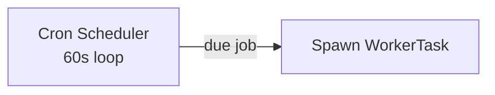

# TradeNext — System Architecture Docs

> Deep-dive documentation on TradeNext's core subsystems. Each doc is written for **both humans and AI agents** — it explains *what* the system does, *why* it is built that way (design reasoning), and *how* data flows (with Mermaid diagrams).

These docs are the **single source of truth** for the subsystems they cover. If code and docs disagree, **trust the code** — then update this doc (per `.agents/documentation-standards.md`).

## Index

| Doc | Covers | Key Files |
|-----|--------|-----------|
| [Daily Recommendations Engine](./daily-recommendations-engine.md) | Screener pipeline → dedup → ranking/cap → AI analysis → storage → Telegram broadcast → performance tracking | `lib/services/dailyRecommendationService.ts`, `lib/services/chartinkService.ts`, `lib/services/ai/recommendation-agent.ts`, `lib/services/ai/*` |
| [Tasks, Cron & Workers](./tasks-cron-workers.md) | CronJob scheduling, WorkerTask queue, worker engine loop, heartbeat, task orchestration, task actions | `lib/services/worker/worker-engine.ts`, `lib/services/worker/worker-service.ts`, `lib/services/worker/task-orchestrator.ts`, `app/api/admin/workers/*`, `app/api/admin/cron/route.ts` |
| [Monitoring & Logging](./monitoring-and-logging.md) | DB-backed logs (serverless-safe), worker file logs, monitoring API tabs, AI monitoring, unified events, health metrics | `lib/services/db-logger.ts`, `lib/services/worker/worker-logger.ts`, `lib/services/ai/ai-monitoring.ts`, `app/api/admin/monitoring/route.ts`, `app/api/admin/ai/monitoring/route.ts`, `lib/services/unifiedEventService.ts`, `lib/services/systemHealthService.ts` |
| [Alerts System](./alerts-system.md) | Price alerts (simple), rule engine (FilterGroup), delivery channels (email/webhook/telegram/in-app), events & delivery logs | `lib/alerts/alert-engine.ts`, `lib/alerts/delivery/index.ts`, `lib/alerts/delivery/{email,webhook,telegram}.ts`, `app/api/alerts/*` |

## How to Use These Docs

### For humans
- Start with the **System Overview** and **Mermaid diagram** at the top of each doc.
- Read the **Step-by-step flow** for the exact sequence.
- Jump to **Design Reasoning** for *why* decisions were made (e.g. why `runInChunks` instead of `$transaction`).

### For AI agents
- Read the doc **before editing** any file listed under "Key Files".
- The **"Agent Hints"** sections list traps, gotchas, and naming conventions you must respect.
- After changes, re-run: `npx tsc --noEmit -p tsconfig.json` and `npm run test` (see `.agents/pre-commit-workflow.md`).

## Diagram Conventions

Mermaid diagrams in this repo use these conventions:

- ` ` for line breaks inside labels
- `"quoted label"` when the label contains special chars like `|` or `→`
- Sequence diagrams use `participant` aliases to keep names short
