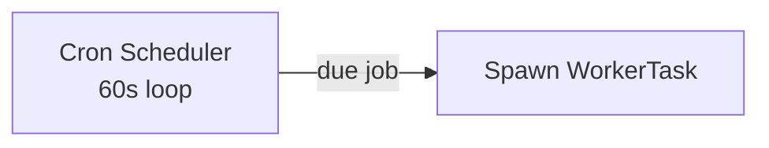

# TradeNext — System Architecture Docs

> Deep-dive documentation on TradeNext's core subsystems. Each doc is written for **both humans and AI agents** — it explains *what* the system does, *why* it is built that way (design reasoning), and *how* data flows (with Mermaid diagrams).

These docs are the **single source of truth** for the subsystems they cover. If code and docs disagree, **trust the code** — then update this doc (per `.agents/documentation-standards.md`).

## Index

| Doc | Covers | Key Files |
|-----|--------|-----------|
| [Daily Recommendations Engine](./daily-recommendations-engine.md) | Screener pipeline → dedup → ranking/cap → AI analysis → storage → Telegram broadcast → performance tracking | `lib/services/dailyRecommendationService.ts`, `lib/services/chartinkService.ts`, `lib/services/ai/recommendation-agent.ts`, `lib/services/ai/*` |
| [Tasks, Cron & Workers](./tasks-cron-workers.md) | CronJob scheduling, WorkerTask queue, worker engine loop, heartbeat, task orchestration, task actions | `lib/services/worker/worker-engine.ts`, `lib/services/worker/worker-service.ts`, `lib/services/worker/task-orchestrator.ts`, `app/api/admin/workers/*`, `app/api/admin/cron/route.ts` |
| [Monitoring & Logging](./monitoring-and-logging.md) | DB-backed logs (serverless-safe), SQLite backup for logs/audit (DB outage resilience), worker file logs, monitoring API tabs, AI monitoring, unified events, health metrics, admin DB health dashboard | `lib/services/db-logger.ts`, `lib/services/worker/worker-logger.ts`, `lib/services/ai/ai-monitoring.ts`, `lib/sqlite.ts`, `app/api/admin/monitoring/route.ts`, `app/api/admin/db-health/route.ts`, `app/admin/utils/db-health/page.tsx` |
| [Alerts System](./alerts-system.md) | Price alerts (simple), rule engine (FilterGroup), delivery channels (email/webhook/telegram/in-app), events & delivery logs | `lib/alerts/alert-engine.ts`, `lib/alerts/delivery/index.ts`, `lib/alerts/delivery/{email,webhook,telegram}.ts`, `app/api/alerts/*` |
| [Playwright E2E](./playwright-e2e.md) | Committed e2e suite (`e2e/`): project matrix, auth bootstrap, agent workflow, reports/Trace Viewer, troubleshooting (browser quirks + dev-server-load flakiness) | `playwright.config.ts`, `e2e/auth.setup.ts`, `e2e/*.spec.ts`, `.github/workflows/playwright.yml` |
| [Database Migration Ledger](./db-migrations.md) | Running bookkeeping of every Prisma migration (what/why/decision), apply + verification workflow, schema-change checklist | `prisma/migrations/`, `prisma/schema.prisma` |
| [Chartink API Reference](./chartink-api.md) | Captured Chartink `screener/process` + `backtest/process` wire formats, DSL, column aliases, capture tool | `lib/services/chartinkScreenerService.ts`, `lib/services/chartinkUnifiedScreenerService.ts`, `scripts/chartink-capture/` |
| [Screener & Backtest](./screener.md) | Legacy deep-dive: v1.16.0 FilterBuilder/BacktestDialog, v1.10.0 enhancement, v3.5.2 TV `change`=% fix, v3.5.5–v3.5.6 Chartink 117-registry + TV fallback unified runner | `lib/services/chartinkUnifiedScreenerService.ts`, `lib/services/chartinkTemplates.ts`, `app/components/screener/TemplatesPanel.tsx` |
| [Corporate Actions](./corp-actions.md) | Legacy deep-dive: dedup fix (v1.10.1), NSE field fix (v1.10.5), enhanced UI (v1.4.0), management (v1.3.0) | `app/api/corporate-actions/*`, `lib/services/syncedDataService.ts` |
| [Security & Workers](./security-workers.md) | Legacy deep-dive: Netlify 502 fix (v1.8.2), cookies/sessions (v1.8.0), cron/workers (v1.7.0), historical sync (v1.6.x) | `middleware.ts`, `lib/auth.ts`, `lib/services/worker/*` |
| [Serverless Logging](./serverless-logging.md) | HISTORICAL — superseded by v3.11.3. Blob-store mirroring, `/tmp` logs, `isServerless()` branches. File logs + DB `ServerLog` table are now the single source of truth | `lib/logger.ts`, `lib/services/db-logger.ts`, `lib/services/worker/worker-logger.ts` |
| [DB Health & SQLite Backup](./monitoring-and-logging.md#sqlite-backup-layer) | SQLite backup layer (sql.js), 10-table sync from Prisma, recovery probe, admin DB health API + dashboard, route fallback chains | `lib/sqlite.ts`, `app/api/admin/db-health/route.ts`, `app/admin/utils/db-health/page.tsx`, `instrumentation.ts` |

## How to Use These Docs

### For humans
- Start with the **System Overview** and **Mermaid diagram** at the top of each doc.
- Read the **Step-by-step flow** for the exact sequence.
- Jump to **Design Reasoning** for *why* decisions were made (e.g. why `runInChunks` instead of `$transaction`).

### For AI agents
- Read the doc **before editing** any file listed under "Key Files".
- The **"Agent Hints"** sections list traps, gotchas, and naming conventions you must respect.
- After changes, re-run: `npx tsc --noEmit -p tsconfig.json` and `npm run test` (see `.agents/pre-commit-workflow.md`).

## Diagram Conventions

Mermaid diagrams in this repo use these conventions:

- ` ` for line breaks inside labels
- `"quoted label"` when the label contains special chars like `|` or `→`
- Sequence diagrams use `participant` aliases to keep names short
