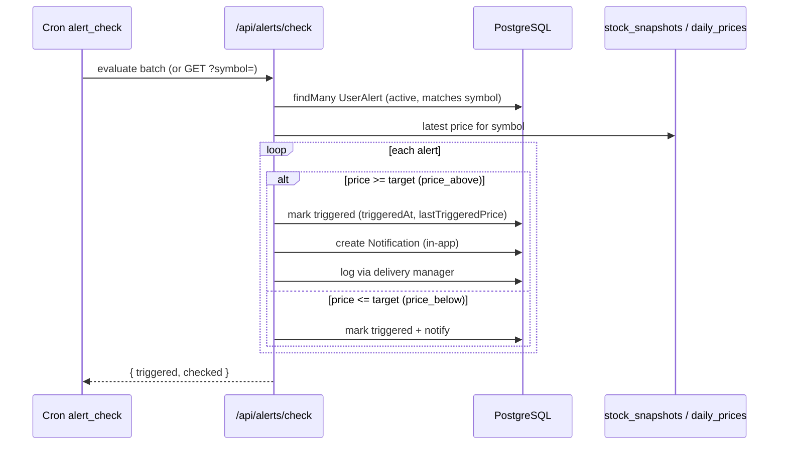
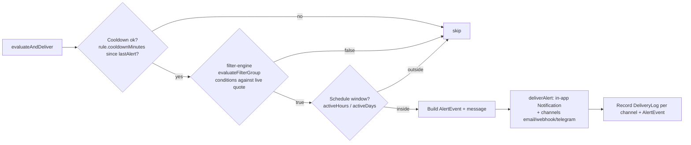
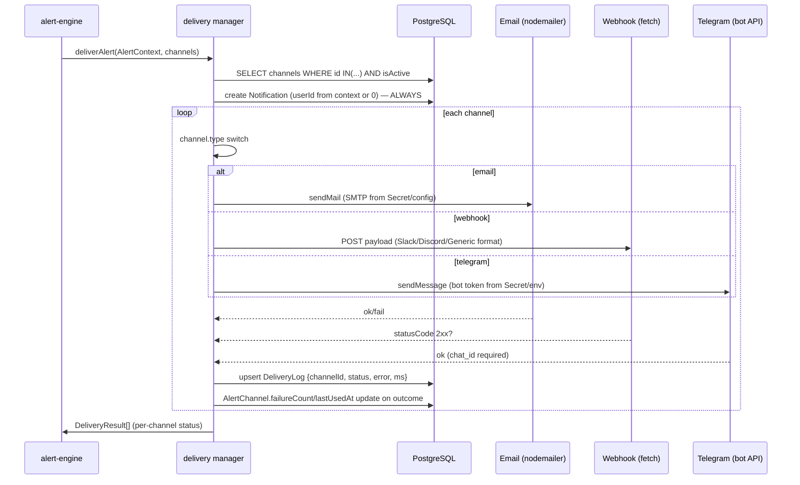

# Alerts System

> TradeNext has **two alert tiers**: the legacy **simple price alerts** (`UserAlert`/`Alert` — threshold vs live price) and the **enterprise rule engine** (`AlertRule` with FilterGroup conditions, schedules, escalations, and multi-channel delivery via `AlertChannel`). Both funnel through one delivery manager that **always creates an in-app notification first**, then pushes to user-owned channels **and** system-wide channels (userId 0).

---

## 1. System Overview

```mermaid
flowchart TD
    subgraph "Triggers"
        T1[UserAlert price check<br/>cron alert_check / /api/alerts/check]
        T2[AlertRule evaluate<br/>/api/alerts/evaluate]
        T3[Corporate action alerts<br/>dividend/bonus/split/rights/buyback]
    end

    subgraph "Evaluation"
        E1[filter-engine<br/>evaluateFilterGroup]
        E2[schedule check<br/>activeHours / activeDays / cooldown]
        E3[action: none|buy|sell|paper_trade]
    end

    subgraph "Delivery Manager"
        D0[Create in-app Notification<br/>ALWAYS first]
        D1[Channel 1: email / webhook / telegram]
        D2[Channel 2 ... N<br/>incl. system-wide userId 0]
        D3[Record AlertEvent + DeliveryLog]
    end

    T1 --> E1
    T2 --> E1
    T3 --> E1
    E1 -->|"conditions true"| E2
    E2 -->|"within schedule"| E3
    E3 --> D0
    D0 --> D1
    D1 --> D2
    D2 --> D3
```

### Key facts
| Aspect | Value |
|--------|-------|
| Simple alerts | `UserAlert` (user) + `Alert` (admin/system) with `price_above` / `price_below` |
| Rule alerts | `AlertRule` — recursive FilterGroup condition tree, Zod-validated |
| Rule trigger | Manual `POST /api/alerts/evaluate` or cron `alert_check` batch |
| Cooldown | Default 60 minutes per rule (configurable `cooldownMinutes`) |
| Delivery channels | email (nodemailer SMTP), webhook (fetch), telegram (env token), push (in-app) |
| System-wide channels | `AlertChannel.userId === 0` — used by all users |
| In-app always | Delivery manager creates `Notification` before any channel attempt |
| Delivery log | `DeliveryLog` per attempt + `AlertEvent` per triggered rule |
| Secrets | `Secret` model — AES-256-GCM encrypted (SMTP passwords, tokens, webhook secrets) |

---

## 2. The Simple Alert Tier (`/api/alerts/check`)



- `force-dynamic` on the route so it never serves stale cache.
- Legacy corporate-action alerts (`dividend_alert`, `bonus_alert`, …) are evaluated in the same check: scans upcoming `corporate_actions` and fires when ex-date is near.
- After triggering, alerts typically **deactivate** (single-shot) unless configured otherwise.

---

## 3. The Rule Engine (`lib/alerts/alert-engine.ts`)

`evaluateAndDeliver(rule, context)` is the heart:



- **Condition tree**: `FilterGroup` = `{ logic: "AND"|"OR", conditions: [FilterCondition...], groups: [FilterGroup...] }`. `FilterCondition` = `{ field, operator, value }` (40+ fields: price, change, volume, RSI, market cap, P/E, …). Reuses `lib/screener/filter-engine.ts` → **same engine that powers the Advanced Screener**.
- **Schedule**: `{ activeHours: [0-23], activeDays: [0-6], cooldownMinutes: number }` in `rule.schedule`. Cooldown default 60.
- **Escalation** (`rule.escalation`): optional list of `{ level, intervalMinutes, channels }` — if unresolved after N minutes, extra channels fire.
- **Action** (`rule.action`): `none` | `buy` | `sell` | `paper_trade` — recorded on the event, not auto-executed (paper_trade is a placeholder for future F&O/portfolio integration).

### AlertRule model (essentials)
```prisma
model AlertRule {
  id        String  @id @default(uuid())
  name      String
  userId    String? // null → system/admin rule
  conditions Json    // FilterGroup tree (Zod-validated)
  channels  String[] // AlertChannel ids
  schedule  Json?    // { activeHours, activeDays, cooldownMinutes }
  escalation Json?   // [{ level, intervalMinutes, channels }]
  action    String?  // none | buy | sell | paper_trade
  isActive  Boolean
  lastTriggeredAt DateTime?
  createdAt DateTime
}
```

---

## 4. Delivery Manager (`lib/alerts/delivery/index.ts`)



- **Order matters**: in-app `Notification` is created **before** any external channel, so the user always sees the alert even if every channel fails.
- **Channel resolution**: channels from the rule/user **plus** system-wide channels (`userId === 0`) — a system email/webhook channel applies to everyone.
- **AlertContext**: `{ userId, rule?, alert?, symbol, currentPrice, changePercent, targetPrice?, eventMeta }`.
- **DeliveryResult**: `{ channelId, status: "sent"|"failed", error?, deliveryLogId }`.
- **Telegram channel** (`delivery/telegram.ts`) needs `telegramChatId`; the *env-based* variant (`telegram-env.ts`) uses `TELEGRAM_SECRET`/`TELEGRAM_CHATID` for admin alerts.

---

## 5. Secrets & Channels Admin (v2.2.0)

- **`Secret` model** — encrypted strings (AES-256-GCM). Used for SMTP passwords, bot tokens, webhook secrets. API `/api/admin/alerts/secrets` returns only **hints/masked** values; decryption happens at delivery time.
- **`AlertChannel` fields**: `type` (email|webhook|telegram|push), `config Json`, `isActive`, `system` (bool), `lastTestedAt`, `lastUsedAt`, `failureCount`.
- **Channel test endpoint** (`/api/alerts/channels/:id/test`) sends a probe and records the result.
- Admin UI: `/admin/alerts` — 4 tabs (User Alerts, Delivery Channels, Secrets, Delivery Logs).

---

## 6. API Surface

| Route | Method | Purpose |
|-------|--------|---------|
| `/api/alerts` | GET/POST | User's simple alerts CRUD |
| `/api/alerts/check` | GET | Force re-check price alerts (used by cron + page load) |
| `/api/alerts/evaluate` | POST/GET | Trigger `evaluateAndDeliver` for rules; GET returns stats |
| `/api/alerts/rules` | GET/POST | Rule list/create |
| `/api/alerts/rules/:id` | GET/PUT/DELETE | Rule CRUD |
| `/api/alerts/channels` | GET/POST | Channel list/create |
| `/api/alerts/channels/:id` | GET/PUT/DELETE | Channel CRUD |
| `/api/alerts/channels/:id/test` | POST | Probe delivery |
| `/api/alerts/events` | GET/POST | Event log (filterable, paginated) + acknowledge |
| `/api/admin/alerts/secrets` | CRUD | Encrypted secrets (admin only) |

---

## 7. Design Reasoning

### 7.1 Why two tiers (simple + rules)?
- **Simple alerts** (price above/below, corporate actions) cover 90% of user needs with a dead-simple model and cheap batch evaluation in cron.
- **Rules** cover power users: multi-condition trees (e.g., "RSI < 30 AND volume > 1.5x AND market cap > ₹10,000Cr"), schedules, escalations, custom actions. Reusing the screener's `filter-engine` means one condition DSL everywhere.

### 7.2 Why in-app Notification always first?
If email/webhook/telegram all fail (SMTP down, webhook 500, no chat ID), the user must still see the alert. The `Notification` row is the **source of truth** the user sees in `/notifications`; channels are best-effort amplification. This also means every alert is auditable even with zero configured channels.

### 7.3 Why system-wide channels (userId 0)?
Admin can set up one SMTP/webhook/telegram config that applies to all users without per-user setup — the deployment-friendly default for small installs. User-owned channels override/extend.

### 7.4 Why encrypted `Secret` storage?
Delivery credentials are high-value secrets. AES-256-GCM with per-record IV + masked hints means the admin UI can show "smtp.***" without ever revealing the token, and decryption is scoped to delivery time.

### 7.5 Why cooldown default 60 min?
Rules can re-evaluate every cron tick (5 min). Without a cooldown, a persistent condition (e.g., price stays below target) would spam the user. 60 min = at most 24 messages/day per rule.

---

## 8. Failure & Recovery Paths

| Failure | Behavior |
|---------|----------|
| Channel fails (SMTP auth, webhook 500, no chat id) | `DeliveryResult.failed` + `DeliveryLog` error row + `failureCount++`; other channels still attempted |
| No channels configured | Only in-app Notification created — success |
| Condition eval throws | Rule skipped, logged, not fired |
| Cooldown active | Rule evaluated but delivery skipped (event records "cooldown") |
| Secret missing for channel | Channel fails with "no secret/config" error; admin sees it in Delivery Logs |

---

## 9. Agent Hints

- **Condition DSL is shared**: `FilterGroup`/`FilterCondition` types come from `lib/screener/condition-tree.ts` — changes there affect alerts + screener + backtest.
- **Cooldown state** lives on the `AlertRule.lastTriggeredAt` — don't add new columns for cooldown; compare `Date.now() - lastTriggeredAt >= cooldownMinutes`.
- Delivery manager must **never throw** into the engine loop — wrap each channel in try/catch and return `DeliveryResult`.
- `runtime = "nodejs"` required on routes that touch Prisma/nodemailer.
- When adding a channel type: extend `AlertChannel.type` enum (Prisma), add a delivery module in `lib/alerts/delivery/`, and a case in the manager's switch — mirror the existing email/webhook/telegram modules.
- Test the **in-app always-first** invariant: a rule with zero channels should still produce a Notification.
