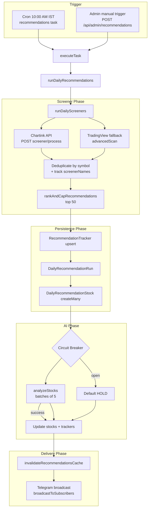
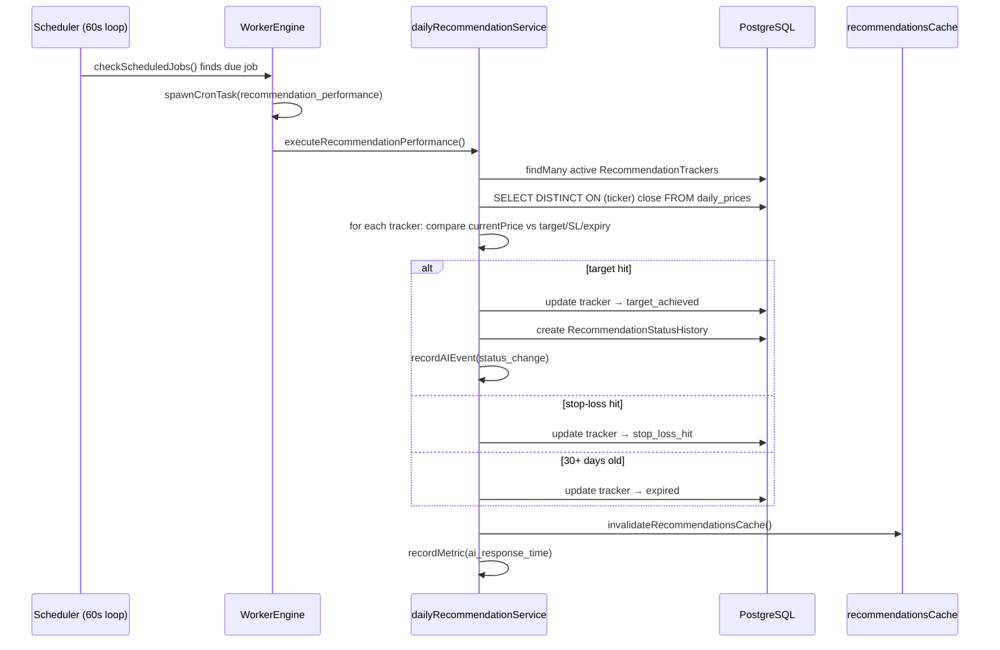
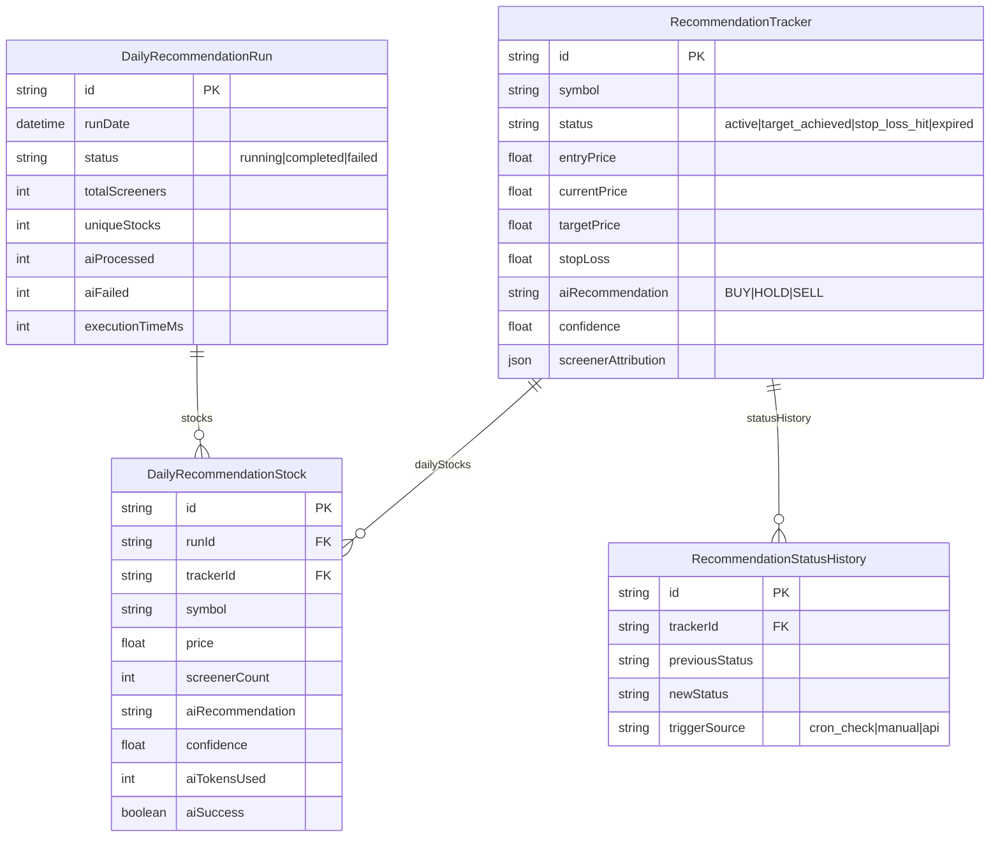

# Daily Recommendations Engine (v3.3.0+)

> The Daily Recommendations Engine is TradeNext's flagship automated analysis pipeline. Every trading day it scans the NSE universe with **7 Chartink screeners**, de-duplicates the hits, **ranks and caps them to the top 50**, runs each through an **AI agent** (OpenRouter) to produce a BUY / HOLD / SELL call with confidence, target and stop-loss, persists everything to the database, and pushes a **Telegram broadcast** to subscribers. A second cron job later **tracks performance** (target hit / stop-loss hit / expiry).

---

## 1. System Overview



### Key facts
| Aspect | Value |
|--------|-------|
| Screeners | 7 (`short_term_breakouts`, `rsi_overbought_oversold`, `boss_scanner_btst`, `bullish_momentum`, `bullish_marubozu_15m`, `potential_breakouts`, `first_15min_breakout`) |
| Screener source | Chartink first, TradingView fallback per screener |
| Max stocks per run | `MAX_RECOMMENDED_STOCKS = 50`, `MAX_AI_STOCKS = 50` |
| AI batching | 5 stocks per AI request |
| Target / SL defaults | +10% / −5% (AI may override); tracker creation uses +20% / −5% |
| Expiry | 30 days (`EXPIRY_DAYS`) |
| Cache | 23h TTL, invalidated after run completes / performance check |

---

## 2. Step-by-step Flow

`runDailyRecommendations()` in `lib/services/dailyRecommendationService.ts`:

1. **Create run record** — `DailyRecommendationRun` with `status: "running"`.
2. **Record start** — `recordScreenerEvent("run_start")` + audit `SCREENER_RUN_START`.
3. **Run screeners** — `runDailyScreeners({ forceRefresh: true })` from `chartinkService.ts`.
   - Each screener tries `POST https://chartink.com/screener/process` with `{ template: "tpl_NN" }` (15s timeout).
   - On failure or empty result → falls back to TradingView `advancedScan()` with the screener's `tradingviewFilters`.
   - TradingView rows are mapped back to `ChartinkStock` shape (including `market_cap_basic`).
4. **Deduplicate** — `deduplicateResults()` merges by upper-cased `nse_script_code`, accumulates `screenerNames` (Set), and keeps the highest price/volume values across runs.
5. **Rank & cap** — `rankAndCapRecommendations()` (see §3) → returns ≤ 50.
6. **Persist trackers** — batch fetch existing `RecommendationTracker`s, `createMany` new ones (skipDuplicates), `updateMany` existing (currentPrice, screenerAttribution, lastCheckedAt) via `runInChunks`.
7. **Persist run stocks** — `createMany` `DailyRecommendationStock` per symbol (runId + trackerId).
8. **AI analysis** — `circuitBreaker.call(() => analyzeStocks(aiInput))` where `aiInput = stockEntries.slice(0, 50)`.
   - If circuit open or analysis throws → every stock falls back to default HOLD @ 50% confidence.
   - Records metrics via `getRecommendationMetrics()`.
9. **Apply AI results** — batch update `DailyRecommendationStock` + `RecommendationTracker` (recommendation, confidence, target, SL, horizon, reasoning, riskFactors, tokens, ms, success).
   - Fire-and-forget `recordPrediction()` (`.catch()` — never breaks the run).
10. **Complete run** — status `completed`, counts, duration, metadata. Record `run_complete` event + `SCREENER_RUN_COMPLETE` audit + health metric.
11. **Invalidate cache** — `invalidateRecommendationsCache()` so UI/Telegram see fresh data.
12. **Telegram broadcast** — non-HOLD picks first (top 8), HOLD fallback if none, BUY/SELL/HOLD breakdown, 4000-char truncation. Non-critical (wrapped in try/catch).

---

## 3. Design Reasoning

### 3.1 Why Chartink-first with TradingView fallback?
- Chartink templates (`tpl_27` etc.) encode battle-tested trader screeners; hitting their API directly is cheaper and more faithful than re-implementing every indicator.
- Chartink is a third-party site with no SLA and aggressive bot protection. TradingView's scanner API is used as a **native, dependable fallback** — the same screeners expressed as filter conditions.
- Each screener therefore carries **both** a `chartinkTemplate` and `tradingviewFilters`, kept in sync manually. **If you edit one, update the other.**

### 3.2 Why rank-and-cap to 50?
The 7 screeners routinely flag **600+ unique symbols**. Sending all of them to the AI provider would:
- Blow up token cost / latency (and hit the AI rate limiter).
- Flood users with noise (the production UI/UX audit flagged "643 recommendations is too many to be useful").

`rankAndCapRecommendations` scores each symbol:
```
score = screenerCount*10 + marketCapScore*2 + momentumScore
```
- **screenerCount*10** (primary): agreement across screeners = stronger signal.
- **marketCapScore** (secondary): bands ≥₹100Cr → 1, ≥₹1,000Cr → 2, ≥₹10,000Cr → 3. Prefers liquid, established names.
- **momentumScore** (tertiary): `clamp(changePercent, -5, 5)` normalized to `[0,1]`.
- Ties break by `screenerCount`. Missing market cap is not penalized (score 0 but still ranked).

### 3.3 Why `runInChunks` instead of interactive `$transaction`?
**This is the critical production lesson (v3.4.1).** The original code wrapped dozens of individual `updateMany` calls in `prisma.$transaction(async () => { ... })`. On production (Prisma Accelerate, remote DB), each statement round-trips over the network, so the whole interactive transaction blew the **5s timeout**:

```
Transaction API error: A rollback cannot be executed on an expired transaction (5000ms timeout, 5501ms passed)
```

Fix: `runInChunks(items, chunkSize, executor)` splits the promise array into chunks (default 10) and `await`s each chunk sequentially. Each write is individually atomic, concurrency is bounded, and there is **no interactive transaction to expire**. This pattern is used in:
- `runDailyRecommendations()` — existing-tracker updates, stock+tracker+prediction updates.
- `checkRecommendationPerformance()` — status updates + history creates + event logs.

> **Agent hint:** When adding batch writes to this service, use `runInChunks` (or a `createMany`/`updateMany` batch). Do **not** reintroduce interactive `$transaction` for bulk writes.

### 3.4 Why cache invalidation after writes?
`getLatestRecommendations()` and `getRecommendationHistory()` cache results (23h / 6h) in `recommendationsCache`. Without invalidation, the UI and Telegram `/recommendations` would keep serving the **stale snapshot from the previous run** even after `checkRecommendationPerformance()` updates prices/statuses. `invalidateRecommendationsCache()` calls `recommendationsCache.flushAll()`.

### 3.5 Why fire-and-forget for predictions & Telegram?
- `recordPrediction()` and the Telegram broadcast are **non-critical side-effects**. A failure there must never fail the whole daily run. Both are `.catch()`-guarded / try-catch-wrapped and logged as warnings.

---

## 4. Performance Tracking (cron at 3:30 PM IST)

`checkRecommendationPerformance()`:



**Status priority order** (only one applied per check):
1. `currentPrice >= targetPrice` → `target_achieved`
2. `currentPrice <= stopLoss` → `stop_loss_hit`
3. `daysSinceCreation >= 30` → `expired`

Prices come from **one** `$queryRaw` with `DISTINCT ON (ticker) ... ORDER BY ticker, "tradeDate" DESC` (avoid N+1). Status transitions are batch-written with `runInChunks`.

---

## 5. Data Model (Prisma)



- `RecommendationTracker` is the **long-lived per-symbol record** (unique `[symbol, createdAt]`).
- `DailyRecommendationStock` is the **per-run snapshot** (unique `[runId, symbol]`).
- `RecommendationStatusHistory` is the **audit trail** of status transitions.

---

## 6. Telegram Integration

- **Broadcast** after a successful run: `broadcastToSubscribers()` → all verified `RecommendationAlertSubscription` chat IDs.
- **Command** `/daily-recommendations` → `lib/services/telegramBotService.ts` handler reads `getLatestRecommendations()` and renders the top picks (prefers `tracker.currentPrice ?? s.price`, tracker target/SL, lifecycle status).
- Broadcast message format: header date, top-8 picks (`🟢 BUY` / `🔴 SELL` / `⚪ HOLD` with price | target | SL | confidence), breakdown line, CTA. Truncated at 4000 chars (Telegram limit).

---

## 7. Failure & Recovery Paths

| Failure | Behavior |
|---------|----------|
| Chartink down / blocked | Per-screener fallback to TradingView (`tryTradingView`), logged as warning |
| All screeners return nothing | Run marked completed with 0 unique stocks (or throws → `failed`) |
| AI provider down / timeout | Circuit breaker tracks failures; after 3 → open (30s cooldown). Analysis falls back to default HOLD. Run still completes |
| Batch write fails | `runInChunks` chunks run independently — one failed chunk does not roll back others (unlike a transaction) |
| Telegram broadcast fails | Logged, run still succeeds |
| Run throws mid-way | Run marked `failed` + `run_failed` event + `SCREENER_RUN_FAILED` audit + health metric, error re-thrown |

---

## 8. Agent Hints

- **Entry point**: `executeRecommendations` / `executeRecommendationPerformance` in `lib/services/worker/worker-service.ts` (dynamic-import the service to avoid circular deps).
- **Never** wrap bulk writes in interactive `$transaction` (see §3.3).
- `getLatestRecommendations()` serves from a **23h cache** — if you change the query, remember `invalidateRecommendationsCache()` or the UI won't show it for a day.
- BigInt fields (`volume`) are converted to `Number` before returning to the client — keep that when extending the API responses.
- The cap constants live at the top of `dailyRecommendationService.ts` (`MAX_RECOMMENDED_STOCKS`, `MAX_AI_STOCKS`). Tests assert the 50 cap (`dailyRecommendationService.test.ts`).
- Keep the 7 `DAILY_SCREENERS` chartink template ↔ TradingView filter mapping in sync.
