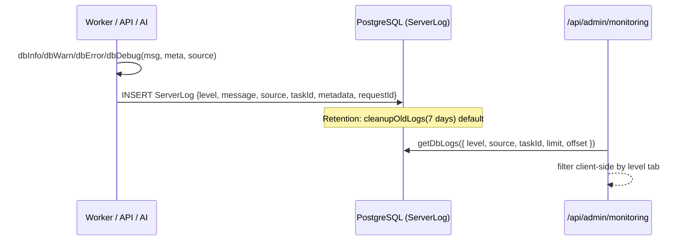
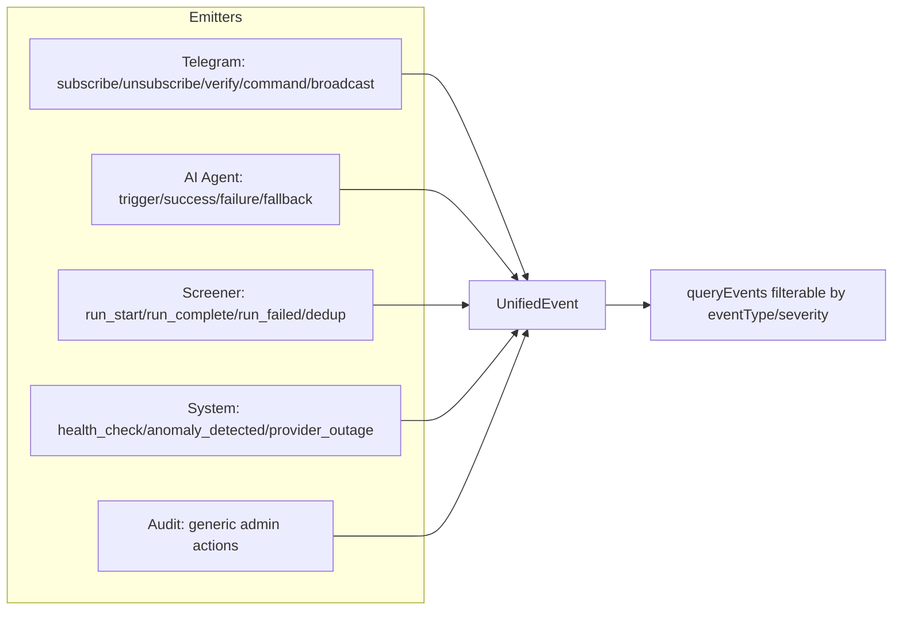
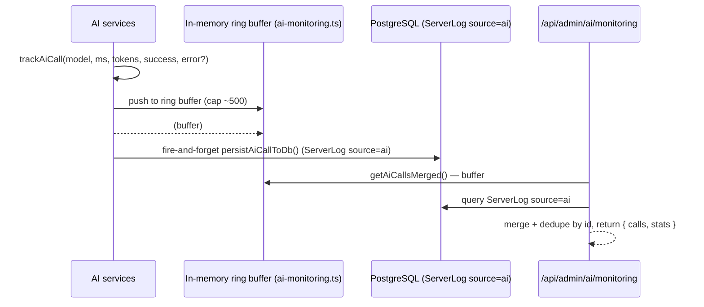

# Monitoring & Logging

> TradeNext captures operational telemetry in **four layers** because it must run on both a **persistent Node host** (file logs work) and **serverless platforms** (file system is ephemeral — everything must fall back to the database). The admin Monitoring page aggregates all four layers behind one tabbed API, and the AI layer keeps its own in-memory ring buffer merged with DB rows.

---

## 1. System Overview

```mermaid
flowchart TD
    subgraph "Producers"
        API[API Routes<br/>nseFetch / actions]
        WORKER[Worker Engine<br/>task execution]
        AI[AI Agent Layer<br/>OpenRouter calls]
        ALERT[Alert Engine<br/>evaluate + deliver]
        BOT[Telegram Bot]
    end

    subgraph "Logging Layers"
        FILE[File logs<br/>.next/server_logs/<br/>worker_logs/]
        DBLOG[DB ServerLog<br/>lib/services/db-logger.ts]
        SQLITE[SQLite backup<br/>sql.js in-memory<br/>server_log, audit_log]
        HTTP[APIRequestLog<br/>http-logger]
        EVENTS[UnifiedEvent<br/>event stream]
        HEALTH[SystemHealthLog<br/>metrics]
    end

    subgraph "Consumers (Admin)"
        MON[/api/admin/monitoring]
        AIMON[/api/admin/ai/monitoring]
        EVAPI[/api/system/events]
        LOGS[/api/admin/logs]
        DBHEALTH[/api/admin/db-health]
    end

    API --> HTTP
    API --> FILE
    WORKER --> FILE
    WORKER --> DBLOG
    AI --> AIMON
    AI --> DBLOG
    ALERT --> EVENTS
    BOT --> EVENTS
    WORKER --> EVENTS
    EVENTS --> HEALTH

    FILE --> MON
    DBLOG --> MON
    HTTP --> MON
    EVENTS --> MON
    HEALTH --> MON
    MON --> LOGS
    AIMON --> DBLOG
    DBLOG --> SQLITE
    SQLITE --> DBHEALTH
```

### Layer summary
| Layer | Store | Purpose | Serverless-safe? |
|-------|-------|---------|------------------|
| **File logs** | `.next/server_logs/*.log`, `worker_logs/*.log` | Rich local detail (pino pretty) | ❌ No (read-only FS) |
| **DB logs** | `ServerLog` table | Persistent logs on serverless; fallback for worker | ✅ Yes |
| **SQLite backup** | `server_log` table (sql.js) | Read access to logs when PostgreSQL is unavailable | ✅ Yes (in-memory) |
| **HTTP logs** | `APIRequestLog` table | Every request: method, path, status, speed | ✅ Yes |
| **Unified events** | `UnifiedEvent` table | Domain events (telegram, ai_agent, screener, system_health, audit) | ✅ Yes |
| **Health metrics** | `SystemHealthLog` table | Timed metrics (ai_response_time, screener_duration, …) | ✅ Yes |
| **AI ring buffer** | In-memory (Node) | `ai-monitoring.ts` per-process buffer + persisted copy | ⚠️ Memory only, merged with DB |

---

## 2. The Logging Layers in Detail

### 2.1 File logs (`lib/services/worker/worker-logger.ts` + pino wrapper)
- `createLogger(name)` → pino instance writing to `.next/server_logs/<name>-<date>.log` (pino-pretty).
- Worker engine creates `.next/server_logs/` at startup (mkdir recursive).
- `worker-logger.ts` wraps pino and **falls back to DB logging** when file writes fail (serverless): `logToDb(entry)`.

### 2.2 DB logs (`lib/services/db-logger.ts`)


**`ServerLog` model:**
```prisma
model ServerLog {
  id         String   @id @default(uuid())
  level      String   // "info" | "warn" | "error" | "debug"
  message    String
  source     String?  // "worker" | "api" | "sync" | "system" | "nse" | "ai"
  taskId     String?
  metadata   Json?
  ipAddress  String?
  userAgent  String?
  requestId  String?
  createdAt  DateTime @default(now())

  @@index([level])  @@index([source])  @@index([taskId])  @@index([createdAt])
}
```
- Cleanup: `cleanupOldLogs(7)` runs on a schedule; `getLogStats()` counts by level/source.

### 2.3 HTTP logs (`APIRequestLog`)
- Middleware/API layer records each request: `method`, `path`, `status`, `durationMs`, `ipAddress`, `userAgent`.
- Consumed by the monitoring "http-logs" tab.

### 2.4 Unified events (`lib/services/unifiedEventService.ts`)


**`UnifiedEvent` model:** `eventType` (telegram | ai_agent | screener | system_health | audit), `eventSubtype`, `source`, `severity` (info | warning | critical), `metadata Json`, `createdAt`.

- `recordEvent(event)` → insert (severity default "info").
- `queryEvents({ eventType, severity, limit, offset, from, to })` → filtered stream.
- Public surface: `GET /api/system/events` (anomaly detection + query) and admin monitoring "alerts" tab.

### 2.5 Health metrics (`lib/services/systemHealthService.ts`)
`SystemHealthLog.metricType`: `ai_response_time` | `screener_duration` | `delivery_rate` | `db_query_time` | `uptime`.
`recordMetric(metricType, value, meta)` → upsert into `SystemHealthLog`; exposed via `/api/system/events` (`type=health`).

---

## 3. Admin Monitoring API (`app/api/admin/monitoring/route.ts`)

Single admin endpoint, tab selector via `?type=`:

| type | Source | Returns |
|------|--------|---------|
| `stats` | DB aggregates | Task/alert/user counts |
| `alerts` | UnifiedEvent | Anomaly alerts (queryEvents severity=warning/critical) |
| `rate-limits` | In-memory rate limiter | Recent rate-limit hits |
| `server-logs` | File logger | Read recent file log lines (only when FS available) |
| `nse-calls` | nse-client cache | Recent NSE API calls + cache hits |
| `http-logs` | APIRequestLog | Recent requests (method/path/status/speed) |
| `server-stats` | os + process | Memory, uptime, CPU |
| `db-logs` | `getDbLogs()` | DB ServerLog rows — **level/source filter**, newest first (v3.4.1) |

All admin monitoring routes: `export const runtime = "nodejs"`, `requireAdmin()`.

---

## 4. AI Monitoring (`/api/admin/ai/monitoring`)



- **Dual persistence** (v3.4.1): `trackAiCall()` writes to the in-memory ring buffer **and** fire-and-forgets `persistAiCallToDb()` → `ServerLog source="ai"`. This survives restarts (DB) while staying instant (memory).
- Admin page (`/admin/utils/ai-monitoring`) shows calls with a **source badge** (memory/DB) and merged stats.
- Test endpoints: `/api/admin/ai/test` (directPrompt with DB config) and `/api/admin/ai/clear-buffer` (reset ring buffer).

---

## 5. Design Reasoning

### 5.1 Why four layers?
Each layer exists because the others fail on some deployment:
- **File logs** are richest for local debugging (pino-pretty, full objects) but vanish on serverless.
- **DB logs** survive everywhere, but are heavy (one row per line) — hence **7-day retention**.
- **HTTP logs** answer "what did the user actually do?" — needed for audit/security review.
- **UnifiedEvents** are *domain semantics* (not raw lines): "telegram subscribe", "screener run failed". Enables anomaly detection and the notifications feed.
- **Health metrics** are *timed values* enabling the degradation dashboard (`ai_response_time`, `delivery_rate`).

### 5.2 Why merge memory + DB for AI?
The in-memory ring buffer gives sub-ms reads for the admin UI, but vanishes on cold start. The DB copy survives. `getAiCallsMerged()` de-dupes by id and presents one stream with a source badge — best of both worlds without making every AI call a blocking DB write (persist is fire-and-forget).

### 5.3 Why 60s heartbeat / 7-day retention / bounded buffers?
- Heartbeat 60s (v3.4.1) cut ~98% of worker DB queries (see [Tasks, Cron & Workers](./tasks-cron-workers.md#21-worker-polling-loop-startworker5000)).
- 7-day log retention is the default `cleanupOldLogs()` window — unlimited rows would bloat `ServerLog` on busy days.
- Ring buffers are capped (~500) so `trackAiCall` never grows unbounded on a long-running host.

### 5.4 Why sanitize task IDs for file paths?
`worker-logger.ts` `sanitizeTaskIdForPath()` validates `/^[A-Za-z0-9_\-:.]+$/` (max 128 chars) before writing `worker_logs/<taskId>.log`. This is a **security control** (path traversal) added in v1.10.6. **Agent hint:** if you ever log user-controlled strings into file paths, apply the same sanitization.

---

## 6. Failure & Recovery Paths

| Failure | Behavior |
|---------|----------|
| File logger can't write (read-only FS) | `worker-logger` falls back to `logToDb()` |
| `persistAiCallToDb` fails | Fire-and-forget — caught, no crash |
| `cleanupOldLogs` fails | Logged, retried next schedule |
| `getDbLogs` slow (huge table) | Filters use indexed columns (level/source/createdAt); paginate via limit/offset |
| NSE API logging (`logAPIRequest`) | Writes `APIRequestLog` via nse-client; failures don't break fetches |

---

## 7. Agent Hints

- **Never commit `.next/server_logs/` or `worker_logs/`** — both are gitignored (check `git status` after any run).
- Use `logger.info({ msg, ...meta })` (pino object form) not `console.log` — the pre-commit hook warns on `console.log` and prod blocks it.
- `dbInfo/dbWarn/dbError/dbDebug` take `(message, metadata?, source?)` — set `source` ("nse", "worker", "ai", …) for correct tab filtering.
- Monitoring API switch cases must use **block-scoped braces** (`case "db-logs": { ... }`) to avoid variable leakage.
- `/api/system/events` is public for viewing; only admin gets anomaly/heal actions.
- Windows dev note: `os.loadavg()` returns `[]` on Windows → CPU stats show 0/undefined locally; don't gate anything on it.
- When extending the admin Monitoring page, add the tab to both `app/admin/utils/monitoring/page.tsx` and the route's `switch(type)`.
