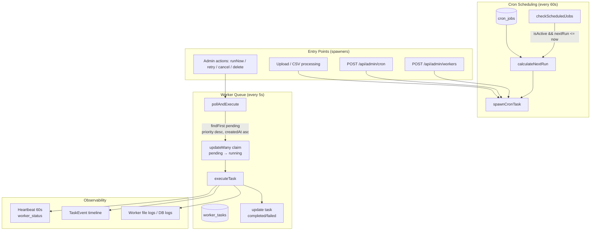
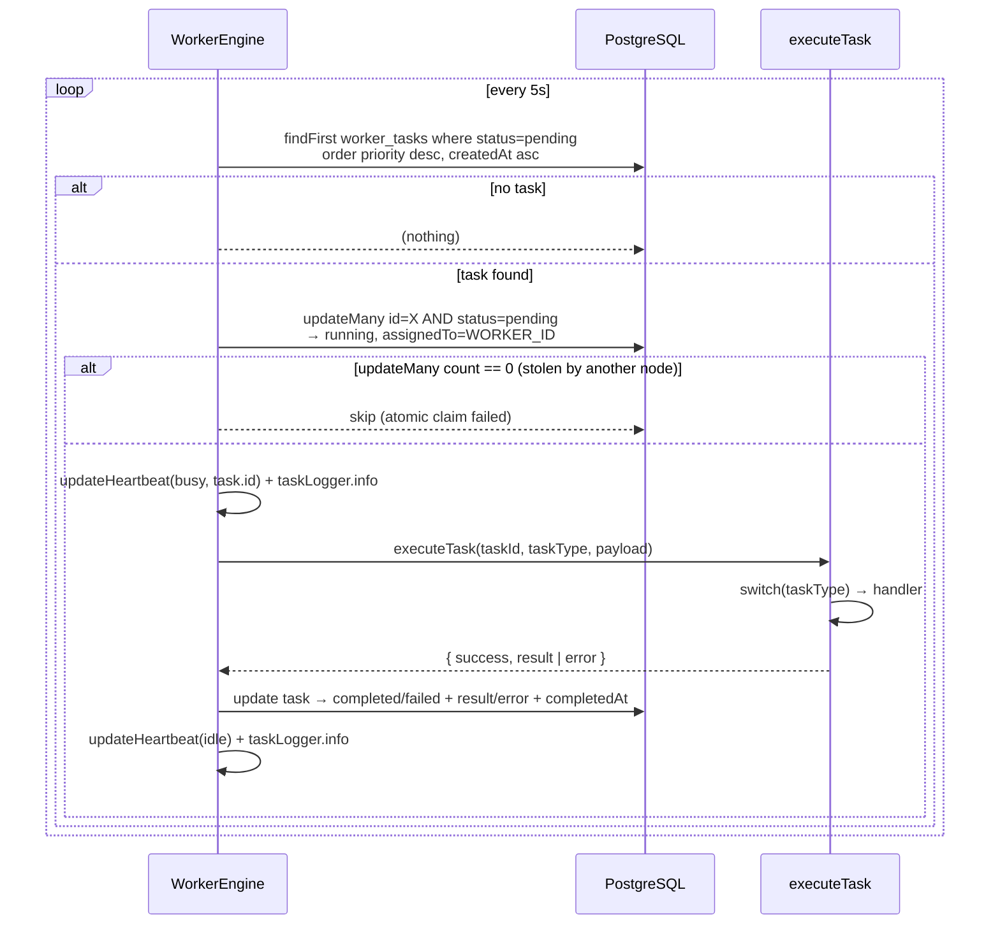
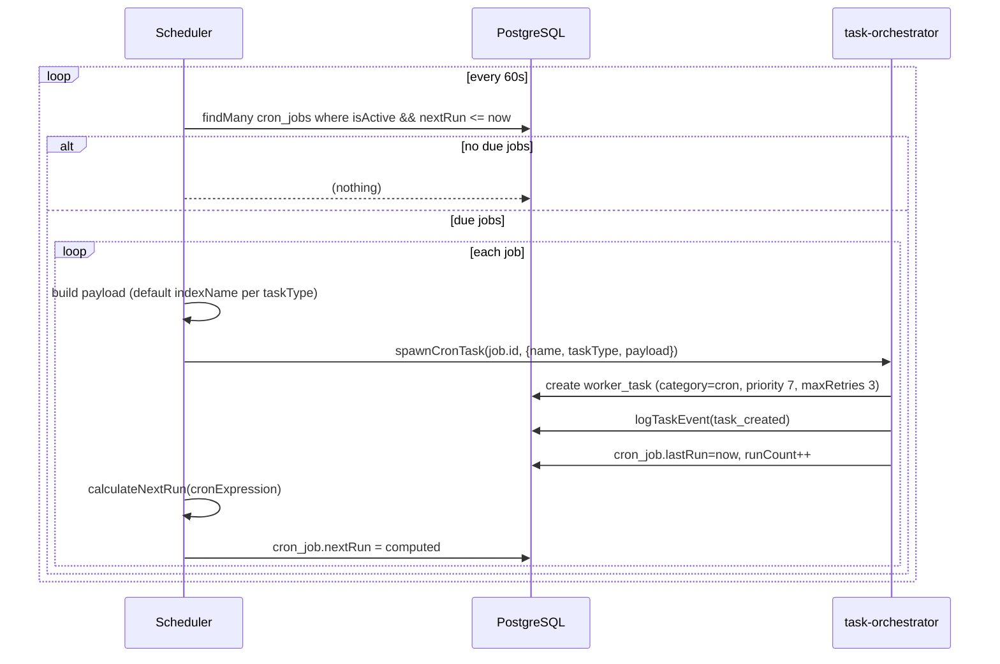

# Tasks, Cron & Workers

> TradeNext runs a **self-hosted background job system** (no external queue service). A long-lived Node process on the server runs two loops: a **worker engine** (polls the `worker_tasks` queue every 5s) and a **cron scheduler** (checks `cron_jobs` every 60s). The worker engine **auto-starts lazily** on the first admin GET to `/api/admin/workers/engine`, so production cron jobs run without manual intervention.

---

## 1. System Overview

### Key facts
| Aspect | Value |
|--------|-------|
| Worker poll interval | 5s |
| Scheduler check interval | 60s |
| Heartbeat interval | 60s (reduced from 5s to cut ~98% of DB queries) |
| Task categories | `cron` / `async` / `regular` |
| Task statuses | `pending` → `running` → `completed` \| `failed` \| `cancelled` |
| Priority | 1–10 (higher = more urgent), default 5; cron tasks default 7 |
| Max retries | Default 3 (field `maxRetries`) |
| Worker ID | `worker-<hostname>-<pid>` |
| Auto-start | On first GET to `/api/admin/workers/engine` (lazy init) |

---

## 2. The Three Loops (`lib/services/worker/worker-engine.ts`)

### 2.1 Worker polling loop (`startWorker(5000)`)

**Atomic claim**: the worker uses `updateMany({ where: { id, status: "pending" }, data: { status: "running" } })`. If another worker already claimed the task, `updateMany.count === 0` and the loop skips it. This is the multi-node safety mechanism (even though TradeNext normally runs a single instance).

**Heartbeat optimization**: originally heartbeat ran every 5s → ~1,036,800 DB queries/month. Now heartbeats write every 60s, with **immediate** heartbeats on task start/end for real-time status. ~17,280 queries/month.

### 2.2 Cron scheduler loop (`startScheduler(60000)`)

**`calculateNextRun` is a simple local parser** — it handles:
- Daily at HH:mm (`* * * * *` pattern with fixed hour/minute)
- Every N minutes (`*/5`, `*/15`, etc.)
- Anything else → +1 hour

> **Agent hint:** It is **not** a full cron library. If you need `0 9 * * 1-5` (weekdays) semantics, either extend `calculateNextRun` or migrate to `cron-parser`.

### 2.3 Heartbeat loop (`updateHeartbeat`)
Upserts `worker_status` with workerId, status (`idle`/`busy`), currentTaskId, memoryUsage (heap MB), cpuUsage (`os.loadavg()[0]`), lastHeartbeat. Errors are silently ignored (a dead heartbeat just means the worker is unreachable — admin UI shows it as offline).

---

## 3. Task Orchestrator (`lib/services/worker/task-orchestrator.ts`)

Central service for **spawning and tracking** tasks.

| Function | Creates | Category | TriggeredBy | Default priority |
|----------|---------|----------|-------------|------------------|
| `spawnCronTask(cronJobId, opts)` | WorkerTask linked to CronJob | `cron` | `cron` | 7 |
| `spawnAsyncTask(opts)` | WorkerTask | `async` | `upload` (customizable) | 5 |
| `spawnRegularTask(opts)` | WorkerTask | `regular` | `admin` (customizable) | 5 |
| `logTaskEvent(taskId, type, msg, meta)` | TaskEvent row | — | — | — |
| `getTaskWithEvents(taskId)` | Read: task + event timeline | — | — | — |
| `getTaskStats()` | Read: grouped stats by category/status | — | — | — |

**TaskEvent types**: `task_created`, `task_started`, `task_completed`, `task_failed`, `task_cancelled`, `task_retried`, `alert_triggered`, `csv_row_processed`, `notification_sent`, `data_synced`.

---

## 4. Task Types & Handlers (`lib/services/worker/worker-service.ts`)

`executeTask(taskId, taskType, payload)` is a **big switch**. Each case calls a private handler:

| taskType | Category | Handler | What it does |
|----------|----------|---------|--------------|
| `stock_sync`, `data_sync` | cron | `executeStockSync` | Fetches index stocks (default `NIFTY TOTAL MARKET`), `syncStocksToDatabase` |
| `corp_actions`, `corp_actions_fetch` | cron | `executeCorpActionsSync` | Parses NSE purposes (dividend/bonus/split/...), upserts `corporate_actions` (unique `symbol_actionType_exDate`) |
| `market_data`, `market_data_fetch`, `historical_sync` | cron/async | `executeMarketDataSync` | Upserts `stock_snapshots` per stock (unique `symbol_capturedAt`) |
| `alert_check` | cron | `executeAlertCheck` | Batch-checks `UserAlert` (price_above/below) + system `Alert` vs `stock_snapshots`; triggers + notifies |
| `screener` | cron | `executeScreener` | Filters last-24h snapshots by payload filters; saves to `screener_results` |
| `screener_sync` | cron | `executeScreenerSync` | Full daily TradingView scan snapshot |
| `recommendations` | cron | `executeRecommendations` | → `runDailyRecommendations()` (see [Daily Recommendations Engine](./daily-recommendations-engine.md)) |
| `recommendation_performance` | cron | `executeRecommendationPerformance` | → `checkRecommendationPerformance()` |
| `events_fetch` | cron | `executeEventsSync` | Fetches NSE event calendar |
| `news_fetch` | cron | `executeNewsSync` | Stub — "not fully implemented yet" |
| `announcement_fetch` | cron | `executeAnnouncementsSync` | Fetches corporate announcements |
| `csv_processing` | async | `executeCsvProcessing` | `runIngestion(filePath)` → daily_prices |
| `password_reset` | regular | `executePasswordReset` | Increments user `tokenVersion` to invalidate sessions |
| `notification_broadcast` | regular | `executeNotificationBroadcast` | Creates notifications for all users or one user |
| `announcement_mgmt` | regular | `executeAnnouncementMgmt` | Create/deactivate `admin_announcements` |
| `maintenance`, `cleanup` | regular | `executeMaintenance` | Deletes old completed/failed tasks, task events, API logs (default 30 days) |
| `fscore_calc` / `fscore_batch` / `fscore_single` | regular | `executeFScoreCalculation` etc. | Piotroski F-Score (9-criteria, simplified) |

Each handler: logs start, runs, logs `task_completed` / `task_failed` events, returns `{ success, result | error }`. Unknown task type throws → `task_failed`.

---

## 5. Admin API Surface

### `/api/admin/workers` (nodejs runtime, admin-only)
| Method | Purpose |
|--------|---------|
| `GET` | List tasks (filter by status/taskType/taskCategory), task detail with events (`?taskId=`), stats |
| `POST` | Create task — Zod-validated (`workerTaskSchema`): name, taskType (enum of all 24 types), category, priority, payload, maxRetries, cronJobId, etc. |
| `PUT ?id=` | Update status/result/error (with timestamp side-effects) |
| `DELETE ?id=` | Hard-delete a task |
| `PATCH` | Actions: `runNow` (pending/failed), `cancel` (pending/running), `retry` (failed), `delete` |

> **Note:** `runNow` and `retry` call `executeTask` **synchronously in the request** — they don't wait for the worker loop. Useful for admin one-off runs but long tasks will block the HTTP response.

### `/api/admin/workers/engine`
- `GET` → **auto-starts** the worker + scheduler (lazy init via module-level `autoStarted` flag), returns `{ isRunning, workerId }`.
- `POST { action: "start" | "stop" }` → start/stop both loops.

### `/api/admin/workers/logs`
- Read worker file logs (per task) or DB logs.

### `/api/admin/cron`
- CRUD for `cron_jobs` (name, description, taskType, cronExpression, isActive, config).

---

## 6. Design Reasoning

### 6.1 Why self-hosted polling instead of a queue broker (Redis/BullMQ)?
TradeNext targets **serverless platforms (Netlify/Vercel) and single VPS** with minimal external dependencies. A DB-backed queue:
- Works on serverless cold starts (the engine starts on first admin hit).
- Needs no extra infra (no Redis). Docker Compose has Redis for local, but prod doesn't require it.
- Trade-off: polling adds latency (5s max) and DB query load — mitigated by the heartbeat reduction (§2.1) and the claim-by-`updateMany` pattern.

### 6.2 Why `updateMany` claim for task pickup?
`findFirst` + `updateMany({ where: { status: "pending" } })` gives **atomic, compare-and-swap style claiming**. Two worker nodes polling simultaneously can't double-run a task: only one `updateMany` wins.

### 6.3 Why lazy auto-start on `/admin/workers/engine` GET?
Production cron jobs must run without anyone clicking "Start". The first admin request to the engine endpoint boots both loops. The `autoStarted` module flag prevents double-start. **Caveat:** on fully serverless platforms (Netlify Functions), long-lived `setInterval` processes may be killed between requests — the engine is reliable on a persistent Node host (VPS, always-on server), which is the deployment model for the worker/cron features.

### 6.4 Why default `indexName` injection in `checkScheduledJobs`?
Different task types need different indices (`stock_sync` → NIFTY TOTAL MARKET, `corp_actions` → NIFTY 50). Rather than trusting every cron config, the scheduler **injects the default** if the payload doesn't specify one. This is also the fix behind v1.12.1.

---

## 7. Failure & Recovery Paths

| Failure | Behavior |
|---------|----------|
| Worker loop throws | Logged (`worker loop error`), loop continues next tick |
| Task handler throws | Task → `failed` + error; `task_failed` event; file/DB log |
| Task claimed by another node | `updateMany` count 0 → silently skip |
| Heartbeat write fails | Ignored (logging only) |
| Cron job spawn fails | Logged (`Failed to spawn task for cron job`), next run still scheduled |
| Retry | Admin `PATCH retry` resets status → `pending`, `error=null`; re-executes immediately |
| Stale tasks | `maintenance`/`cleanup` task deletes completed/failed/cancelled tasks + events + API logs older than N days |

---

## 8. Agent Hints

- **New task type** = 3 edits: add a `case` in `executeTask`, add it to the `workerTaskSchema` enum in `app/api/admin/workers/route.ts`, and (if scheduled) a cron preset/config.
- **Always `export const runtime = "nodejs"`** on admin routes using Prisma (`app/api/admin/workers/route.ts` does).
- Dynamic `import()` inside handlers avoids circular dependencies (e.g. worker-service → dailyRecommendationService).
- The heartbeat is now 60s — if you add real-time "worker busy" UI, trigger `updateHeartbeat("busy", task.id)` on claim (already done) rather than waiting for the interval.
- `os.loadavg()` is **not available on Windows** (returns `[]`) — memory is fine, CPU shows `0`/undefined locally. Do not depend on it on Windows dev boxes.
- Zod validation uses `z.record(z.string(), z.unknown())` for payloads — JSON objects only, no arrays at the top level.
