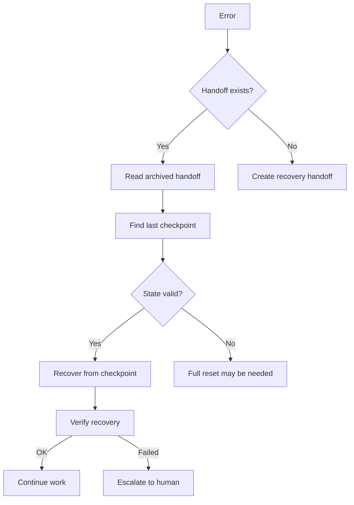

# Error Recovery Flow

> How the system handles and recovers from agent errors and failures.

## Recovery Principles

1. **Never lose context** - Handoff files preserve state even on crash
2. **Checkpoint forward** - Recovery rolls forward from last checkpoint, not back
3. **Idempotent operations** - Re-running the same operation is safe
4. **Graceful degradation** - Partial completion is better than no completion

## Error Types and Responses

| Error Type | Detection | Recovery Strategy |
|------------|-----------|--------------------|
| Connection Loss | Agent stops responding | Next session reads `latest.md` and continues |
| Token Limit | Agent context overflow | Handoff with compressed state to new session |
| Build Failure | TypeScript/Lint errors | Record in handoff, handoff to GH Helper |
| Test Failure | Unit/E2E failing tests | Record in handoff, handoff to QA |
| API Rate Limit | NSE/TradingView API limits | Record in handoff, retry with backoff |
| Git Conflict | Merge conflict | Record conflict details, handoff to Integrator |

## Recovery Handoff Template

```yaml
---
handoff_version: "1.0"
session_id: "sess-20260716-103000"
agent: "opencode"
timestamp: "2026-07-16T10:30:00Z"
status: "recovery_needed"
priority: "critical"
checkpoint: "cp-{feature}-{step}-{num}"
---
```

## Context
- **Failed Task**: What was being done when error occurred
- **Error**: Error message and stack trace
- **Branch**: Current git branch
- **Checkpoint**: Last successful checkpoint

## Recovery Plan
1. Step to recover (from checkpoint)
2. What to verify after recovery

## Prevention
- Root cause analysis
- How to prevent in future
- Lesson to add to Lessons.md
```

## Checkpoint System

### What to Checkpoint

- Before any destructive operation (migration, reset)
- After completing each logical unit of work
- When encountering complex state (multi-file edits)
- Before agent handoff

### Checkpoint Format

```markdown
## Checkpoint: cp-feature-auth-3
- **State**: All NextAuth config done, Google provider wired
- **Git Commit**: abc123def456
- **Reachable From**: Any session reading this handoff
- **Rollback**: `git revert abc123def456` + disable provider in auth config
```

## Recovery Flow Diagram


