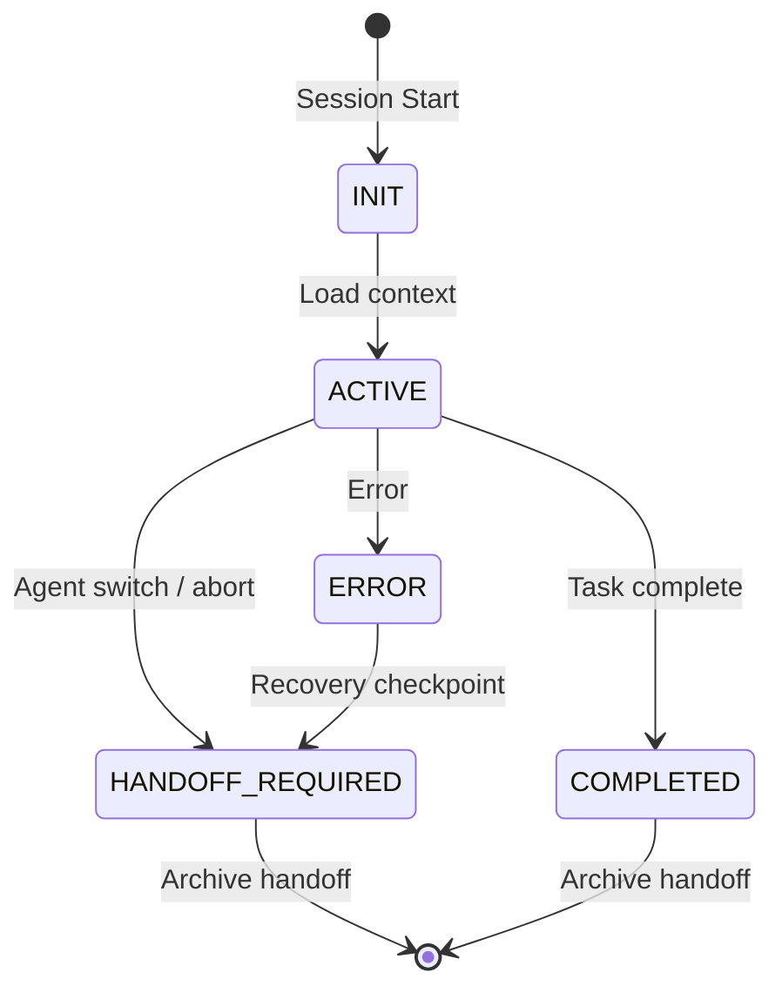

# Session Lifecycle Flow

> Defines the complete lifecycle of an agent session from start to handoff.

## Session States



## 1. INIT - Session Initialization

Every agent MUST perform these steps at session start:

### Step 1.1: Read Orchestration State
```bash
# Always read these files in order
1. HANDOFF.md          # Root orchestration state
2. .agents/handoffs/active/latest.md  # Current handoff context
3. AGENTS.md           # Development guide + version history
4. Primer.md           # Project status
5. Lessons.md          # Rules & corrections
6. agent-memory.md     # Recent activities
```

### Step 1.2: Validate Handoff
- Check if `latest.md` status is `handoff_required`
- If yes, prioritize resolving pending items
- If no, proceed with new task

### Step 1.3: Initialize Tracking
- Generate `session_id` as `sess-YYYYMMDD-HHMMSS`
- Update `HANDOFF.md` status to `in_progress`
- Record start in `agent-memory.md`

## 2. ACTIVE - Working State

During active work:
1. Update `latest.md` progress section in real-time
2. Log significant decisions in `agent-memory.md`
3. Record failures/new patterns in `Lessons.md`

### Checkpoint Strategy
- **Minor checkpoints**: After each file edit (auto)
- **Major checkpoints**: After completing a logical unit of work
- **Recovery checkpoints**: When encountering complex multi-step work

## 3. HANDOFF_REQUIRED - Agent Switch

When handing off to another agent or ending a session:
1. **Finalize progress** - Update all checklists
2. **Document decisions** - Why things were done
3. **Note blockers** - What's blocking and how to resolve
4. **Archive handoff** - Move `latest.md` to `archive/`
5. **Update HANDOFF.md** - Set new orchestration state

### Handoff Command
Use `/handoff` to:
- Create a checkpoint for another agent
- Signal that human review is needed
- Request a specialized agent (e.g., QA, DevOps)

## 4. COMPLETED - Task Done

When a task is fully complete:
1. **Update ALL documentation** - AGENTS.md, Primer.md, agent-memory.md, Lessons.md
2. **Archive handoff** - With final status `completed`
3. **Reset latest.md** - To clean template
4. **Update HANDOFF.md** - Set status to `ready`

## 5. ERROR - Error Recovery

If a session encounters an unrecoverable error:
1. **Create recovery handoff** - With error details and checkpoint
2. **Set status** to `failed` with error description
3. **Archive** the failed handoff
4. **Signal** in HANDOFF.md that recovery is needed

## Checklist

### Session Start Checklist
- [ ] Read HANDOFF.md
- [ ] Read `.agents/handoffs/active/latest.md`
- [ ] Read AGENTS.md, Primer.md, Lessons.md
- [ ] Validate if handoff_required
- [ ] Initialize session_id

### Session End Checklist
- [ ] All progress documented
- [ ] Decisions and rationale recorded
- [ ] Blockers documented (if any)
- [ ] Learnings added to Lessons.md
- [ ] Handoff archived with dated filename
- [ ] HANDOFF.md updated with new state
- [ ] Primer.md updated
- [ ] agent-memory.md updated
