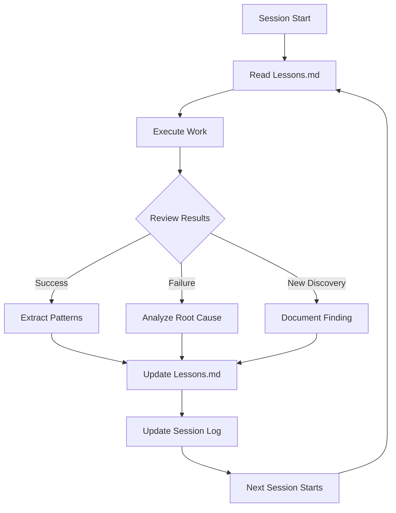

# Self-Learning Loop System

> Continuous improvement through systematic reflection and pattern extraction.

## Overview

The Self-Learning Loop ensures that every agent session contributes to the project's collective intelligence. Each session reflects on what worked, what didn't, and captures patterns that future sessions can apply.

## Learning Loop



## Files

| File | Purpose |
|------|---------|
| `README.md` | This file - system overview |
| `session-log.md` | Log of all sessions with outcomes |
| `patterns/` | Reusable patterns extracted from work |
| `metrics/` | Session effectiveness metrics |

## Pattern Extraction Process

After every significant work session, extract:

### 1. What Worked
```markdown
- **Pattern**: Description of the successful approach
- **Context**: When to use this pattern
- **Example**: Code snippet or link
- **Frequency**: How often this has been successful
```

### 2. What Didn't
```markdown
- **Anti-Pattern**: Description of what failed
- **Root Cause**: Why it failed
- **Alternative**: What to do instead
- **Cost**: Time lost or issues caused
```

### 3. New Rules
When a pattern repeats or an anti-pattern causes damage, promote it to:
- `Lessons.md` - Permanent rule with enforcement
- `checklist.md` - Automated validation (YAML)
- `checklist.md` - Manual validation (markdown)

## Session Effectiveness Metrics

```markdown
## Per-Session Metrics
- **Time to First Commit**: How long before first meaningful change
- **Build Success Rate**: Percentage of builds that pass on first try
- **Test Failure Rate**: Percentage of test failures that need fixes
- **Handoff Quality**: How often handoffs have complete context
- **Pattern Discovery**: Number of new patterns extracted
```

## Automated Learning Triggers

| Trigger | Action |
|---------|--------|
| 3 similar bugs in same area | Create rule in Lessons.md |
| Repeated build failures | Add to pre-commit checklist |
| Successful new pattern | Document pattern in patterns/ |
| Agent handoff issues | Update handoff schema |
| Documentation gaps | Flag for docs update |

## Maturity Model

| Level | Name | Description |
|-------|------|-------------|
| 1 | Initial | Ad-hoc learning |
| 2 | Documented | Lessons recorded in Lessons.md |
| 3 | Measured | Metrics tracked per session |
| 4 | Automated | Hooks enforce patterns |
| 5 | Optimized | System self-improves |
