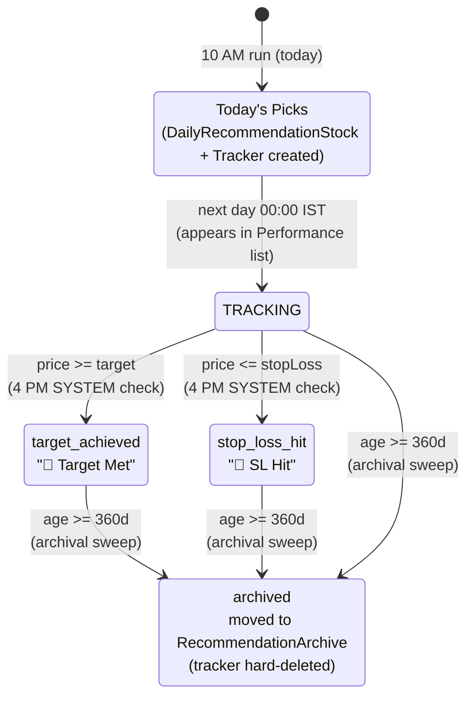
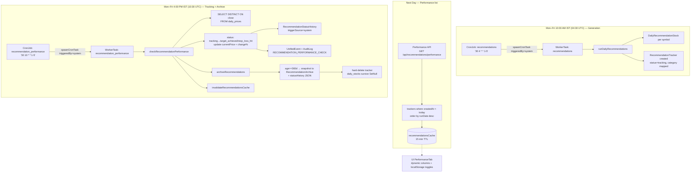
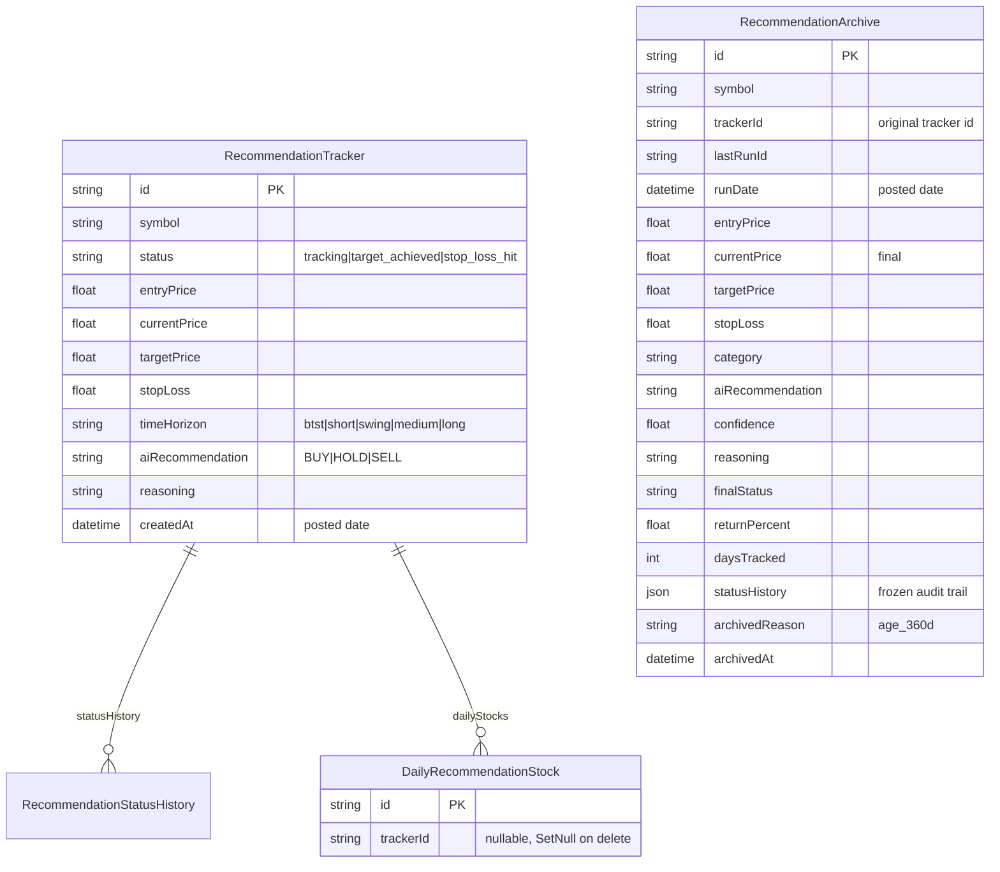
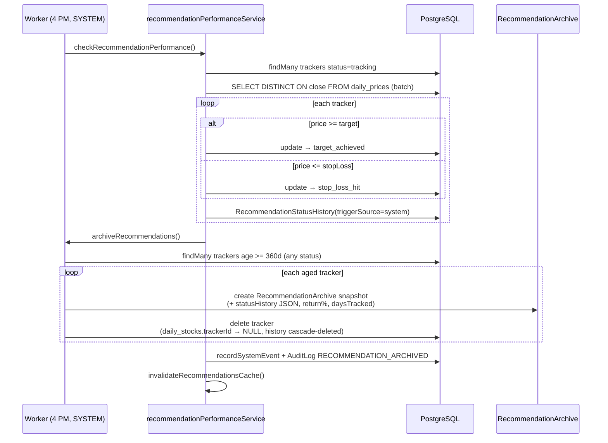

# Recommendation Performance Tracking & Archival (v3.5.0)

> Feature: a dedicated **Performance** section for daily recommendations — a live, cached, dynamic-column table that shows what happened to every recommendation after it was posted (current price, target, SL, change, status, category, hold reasoning). Recommendations move into the performance list **the next day**, are tracked by a **4 PM IST Mon–Fri SYSTEM cron/worker** (target-met / SL-hit / hold analysis), and are **archived after 360 days** by hard-deleting the live tracker into a frozen `RecommendationArchive` snapshot table.

---

## 1. Overview

The v3.3.0 engine already *generates* recommendations (10 AM IST) and *checks* performance (3:30 PM IST). This feature:

1. **Replaces the 30-day expiry** with a clean 3-status lifecycle: `tracking → target_achieved / stop_loss_hit → archived (360d)`.
2. **Moves the performance check to 4 PM IST Mon–Fri** (`0 16 * * 1-5` IST = `30 10 * * 1-5` UTC) and **marks the worker tasks `triggeredBy: "system"`** with full audit logging (WorkerTask + TaskEvent + UnifiedEvent + AuditLog).
3. **Adds a public Performance tab** next to History with **dynamic columns** (show/hide persisted per-browser) and **server-side cached** values.
4. **Adds archival**: after 360 days (or immediately for already-done statuses when swept), the tracker is snapshotted into `RecommendationArchive` and **hard-deleted** from `RecommendationTracker`. Per-run `DailyRecommendationStock` rows survive via `onDelete: SetNull` so the History tab keeps working.
5. **Extends categories** from `short|medium|long` to `btst | short | swing | medium | long` (BTST for the 15-min screeners, swing for momentum/breakout screeners, medium kept for legacy rows).

---

## 2. Lifecycle & State Machine



- **`tracking`** — in the performance list; updated daily at 4 PM with latest price, change %, and a fresh target/SL comparison. Hold reasoning is the AI `reasoning` text.
- **`target_achieved` / `stop_loss_hit`** — terminal *outcome* statuses; **stay visible** in the Performance list (status badge "Target Met" / "SL Hit") until the 360-day sweep archives them.
- **`archived`** — not stored on the tracker (it no longer exists); represented by a row in `RecommendationArchive`.

**Archival trigger (per user decision):** the 360-day age is the *only* trigger. Target/SL hits are display flags, not archival triggers. One sweep runs at the end of each 4 PM performance-check worker.

---

## 3. End-to-End Flow



---

## 4. Data Model Changes (Prisma)



**Schema edits:**
- `RecommendationArchive` — **new** table (frozen snapshot, see ER above).
- `DailyRecommendationStock.trackerId` — **nullable + `onDelete: SetNull`** (was required Cascade). Required so per-run history survives tracker hard-delete; the History/top-stocks query switches to `LEFT JOIN`.
- `RecommendationStatusHistory` — unchanged; cascade-deleted with the tracker **after** being frozen into `RecommendationArchive.statusHistory` JSON.
- `RecommendationTracker` — no new columns needed. `status` values backfilled (`active → tracking`; legacy `expired` rows either become tracking (age < 360d) or archive immediately (age ≥ 360d)).

**Category mapping (backfill + new runs):**
| Screener | Category |
|---|---|
| `boss_scanner_btst`, `bullish_marubozu_15m`, `first_15min_breakout` | `btst` |
| `short_term_breakouts`, `rsi_overbought_oversold` | `short` |
| `bullish_momentum`, `potential_breakouts` | `swing` |
| (none today) | `long` |
| legacy `medium` rows | kept as `medium` (displayed "Swing") |

---

## 5. Cron & Worker Changes

### 5.1 `calculateNextRun` weekday support ⚠️
Both `lib/services/worker/worker-engine.ts` and `app/api/admin/cron/route.ts` implement a **local** cron parser that today only handles *daily-at-time* and *every-N-minutes*. `0 16 * * 1-5` would fall through to "+1 hour". **Both parsers must learn weekday ranges** (`1-5`, and ideally `MON-FRI` + `*/N` minute ranges) so Mon–Fri scheduling works.

### 5.2 `triggeredBy: "system"`
`spawnCronTask()` in `task-orchestrator.ts` hardcodes `triggeredBy: "cron"`. Add an optional `triggeredBy?: string` override. Recommendation crons pass `"system"` so every worker task in `/admin/workers` is marked SYSTEM, and `TaskEvent`, `UnifiedEvent` (`recordSystemEvent`), and `AuditLog` entries carry `triggerSource: "system"`.

### 5.3 Self-healing cron registration
Cron jobs are **not seeded anywhere** today (admins create them manually). Add `ensureRecommendationCrons()` — called lazily when the worker engine starts and on admin recommendations GET — that upserts two active jobs:

| CronJob name | taskType | Expression | IST | Purpose |
|---|---|---|---|---|
| `Daily Recommendations (System)` | `recommendations` | `30 4 * * 1-5` | 10:00 AM Mon–Fri | generation |
| `Recommendation Performance Check (System)` | `recommendation_performance` | `30 10 * * 1-5` | 4:00 PM Mon–Fri | tracking + archival |

### 5.4 Admin triggers spawn workers
`POST /api/admin/recommendations` `run_now` / `check_performance` currently call services synchronously. Change to **spawn worker tasks** (`triggeredBy: "system"`, taskCategory `regular`/`cron`) and return the `taskId` — visible in `/admin/workers` for monitoring. (Keeps admin actions observable, not fire-and-forget orphans.)

---

## 6. API Surface

| Route | Method | Auth | Purpose |
|---|---|---|---|
| `/api/recommendations/performance` | GET | public | Paginated performance list: `limit/offset/status/category/recommendation/sort`. Returns `{ success, items, total, columns, cachedAt }`. **Cached 15 min** via `recommendationsCache`, invalidated by the 4 PM worker. |
| `/api/recommendations/performance` | GET `?columns=1` | public | Dynamic column metadata (id, label, type: price/pct/badge/text/date, sortable). |
| `/api/admin/recommendations` | POST `run_now` / `check_performance` | admin | Spawns worker task (triggeredBy system), returns `{ taskId }`. |
| `/api/admin/recommendations/archive` | POST | admin | Manual archival sweep (age ≥ 360d), returns counts. |

**Performance list item shape:**
```jsonc
{
  "symbol": "RELIANCE",
  "postedDate": "2026-08-01T04:30:00Z",     // run date
  "category": "swing",                        // btst | short | swing | medium | long
  "recommendation": "BUY",                    // BUY | HOLD | SELL
  "confidence": 78,
  "entryPrice": 2500, "currentPrice": 2650,   // current = last daily_prices close
  "changePct": 6.0,                           // vs entry
  "targetPrice": 2800, "stopLoss": 2375,
  "status": "tracking",                       // tracking | target_achieved | stop_loss_hit
  "reasoning": "…hold analysis text…",         // shown for HOLD / any
  "daysTracked": 14
}
```

**Dynamic columns** (API-driven, UI renders what the API advertises; user toggles persist in `localStorage`):
`symbol, postedDate, category, recommendation, confidence, entryPrice, currentPrice, changePct, targetPrice, stopLoss, status, reasoning, daysTracked`.

---

## 7. UI — Performance Tab

- New **5th tab** on `/recommendations`: `🎯 Performance` (between History and Dividends).
- **Table** (not cards) with sortable columns, status badges (`🎯 Target Met` / `🛑 SL Hit` / `📊 Tracking`), recommendation badges (BUY/HOLD/SELL), category chips, reasoning expandable under HOLD.
- **Column manager**: ⚙ button → show/hide toggle list (persisted in `localStorage` per key `tradenext:rec-perf-columns`); API-driven column metadata so adding a column later needs zero UI edits.
- **Filters**: status pills (All / Tracking / Target Met / SL Hit), category select, recommendation select. **Pagination** (server-side).
- **States**: skeleton loading, empty ("No tracked recommendations yet — picks move here the next day"), error + retry, responsive (table scrolls horizontally < 768px), dark-mode aware (matches existing `bg-gray-950` theme).

---

## 8. Archival Process (sequence)



- Writes use `runInChunks` (bounded concurrency) — **no interactive `$transaction`** (Lesson 46).
- Archive creation and tracker deletion are done **per tracker** (create → then delete) so a failure mid-sweep never loses data; the sweep is idempotent (archiving a tracker whose delete failed is re-attempted next run because it's still in `RecommendationTracker`).
- `RecommendationArchive` rows are immutable; nothing in the live path reads them (admin-only future UI).

---

## 9. Design Decisions & Tradeoffs

| Decision | Choice | Why / tradeoff |
|---|---|---|
| 30-day expiry | **Removed** — 3-status lifecycle | User decision; a 360-day window is meaningless if trackers stop being checked at day 30. |
| Archival trigger | **Age ≥ 360d only** | User decision; target/SL hits are display flags. Simple, predictable, no surprise deletions. |
| Archive storage | **Hard-delete to `RecommendationArchive`** | User decision. Cleaner live table, but **requires** `DailyRecommendationStock.trackerId → SetNull` + `LEFT JOIN` in History so per-run history survives. Status history is frozen into the archive JSON before delete. |
| Categories | **Extend to 5 values** | User decision. `timeHorizon` is a plain `String` in Prisma — no enum migration risk; backfill script maps legacy `medium`. |
| Performance list entry | **Next-day date filter** (`createdAt < today`) | No extra flag/column needed; today's picks are excluded, everything else is "in the list". |
| Caching | 15-min TTL + invalidation after 4 PM worker | Prices move intraday; 23h cache would be stale. Cheap because the 4 PM worker invalidates. |
| Price source | `daily_prices` `DISTINCT ON (ticker)` batch | One query for all symbols (existing pattern, no N+1). |
| UI columns | API-driven metadata + localStorage toggles | Adding a column = add to API list; no component rewrite. No user accounts needed for persistence. |
| Admin triggers | Spawn worker tasks (triggeredBy system) | Every action visible in `/admin/workers` with TaskEvents; no orphan fire-and-forget. |

---

## 10. Failure & Recovery

| Failure | Behavior |
|---|---|
| Cron parser can't schedule Mon–Fri | **Fixed** — weekday-range support added to both parsers; `ensureRecommendationCrons` computes `nextRun` correctly. |
| 4 PM check partially fails | `runInChunks` — one failed chunk doesn't roll back others; cache still invalidated; error logged. |
| Archive sweep fails mid-way | Per-tracker create→delete; unarchived trackers simply re-enter the sweep next run (idempotent). |
| History tab after archive | `LEFT JOIN` on trackers; archived stocks show `trackerStatus: null` with per-run snapshot prices. |
| Worker never boots on serverless | Same as today — engine auto-starts lazily on admin engine GET; reliable on persistent host (documented limitation). |
| AI fails during generation | Unchanged — circuit breaker + default HOLD fallback (existing). |

---

## 11. Agent Hints

- **New service file**: `lib/services/recommendationPerformanceService.ts` (keeps `dailyRecommendationService.ts` from bloating). Dynamic-import it from `worker-service.ts` to avoid circular deps.
- **Never** use interactive `$transaction` for bulk writes — `runInChunks` (Lesson 46). **Always** `invalidateRecommendationsCache()` after writes behind a long-TTL cache (Lesson 47).
- **Raw SQL** must use the `@@map` table names (`recommendation_trackers`, `daily_recommendation_stocks`) and camelCase quoted columns (`"targetPrice"`) (Lessons 41–42).
- `timeHorizon` is a **string**; category display maps `btst`→"BTST", `short`→"Short Term", `swing`→"Swing", `medium`→"Swing (legacy)", `long`→"Long Term".
- New task types don't change — `recommendations` / `recommendation_performance` already exist in `executeTask`; we only change scheduling + marking + audit.
- Keep the two cron expressions in sync between `ensureRecommendationCrons()` and this doc.

---

## 12. Implementation Plan (ph20)

> Phased build order. Each phase ends with a verification step. This file lives in `docs/designDoc/` so every future phase can record its design decisions next to the code.

### Phase 1 — Schema & data backfill
- [ ] `prisma/schema.prisma`: add `RecommendationArchive` model; `DailyRecommendationStock.trackerId` → nullable + `onDelete: SetNull` (done).
- [ ] Run `npx prisma generate` + `npx prisma migrate dev --name add_recommendation_archive`.
- [ ] `scripts/backfill-recommendation-categories.ts` (idempotent, run once):
  - status `active` → `tracking`; legacy `expired` with age ≥ 360d → archive immediately, else → `tracking`.
  - map `timeHorizon`: 15-min screeners → `btst`, short-term screeners → `short`, momentum/breakout screeners → `swing`; leave `medium`/`long` as-is.
- **Verify:** `npx prisma generate` clean; schema introspect shows new table; backfill counts logged.

### Phase 2 — Cron & worker (SYSTEM marking)
- [ ] Extend `calculateNextRun` in `lib/services/worker/worker-engine.ts` **and** `app/api/admin/cron/route.ts` to support weekday ranges (`1-5`, `MON-FRI`).
- [ ] `spawnCronTask()` in `lib/services/worker/task-orchestrator.ts`: optional `triggeredBy` override (default `"cron"`).
- [ ] New `ensureRecommendationCrons()` in `lib/services/recommendationCronService.ts`: upsert 2 active CronJobs:
  - `Daily Recommendations (System)` — `recommendations` — `30 4 * * 1-5` (10:00 AM IST)
  - `Recommendation Performance Check (System)` — `recommendation_performance` — `30 10 * * 1-5` (4:00 PM IST)
  - Call lazily from worker-engine `startWorker`/`startScheduler` and admin recommendations GET.
- [ ] `lib/audit.ts`: add `RECOMMENDATION_PERFORMANCE_CHECK`, `RECOMMENDATION_ARCHIVED`, `RECOMMENDATION_PERFORMANCE_MOVED` actions.
- **Verify:** unit tests for weekday parsing; cron upsert is idempotent (double-call safe).

### Phase 3 — Performance service + reworked check
- [ ] `lib/services/recommendationPerformanceService.ts`:
  - `getPerformanceList({ limit, offset, status, category, recommendation, sort })` — trackers `createdAt < today` (next-day promotion), cached 15 min via `recommendationsCache`, BigInt-safe, returns `{ items, total, columns }`.
  - `archiveRecommendations()` — trackers age ≥ 360d → snapshot into `RecommendationArchive` (+ `statusHistory` JSON, return %, days tracked) → hard-delete tracker; `runInChunks`; idempotent; `invalidateRecommendationsCache()`.
  - `getPerformanceColumns()` — dynamic column metadata for the UI.
- [ ] Rework `checkRecommendationPerformance()` in `dailyRecommendationService.ts`: remove `EXPIRY_DAYS`/30-day path; statuses `tracking → target_achieved / stop_loss_hit`; update `currentPrice` + `changePercent`; `RecommendationStatusHistory.triggerSource = "system"`; fold `archiveRecommendations()` at end; `invalidateRecommendationsCache()`.
- **Verify:** unit tests cover status transitions, no 30-day expiry, archive boundary at 360d, snapshot completeness, history survival (SetNull).

### Phase 4 — API
- [ ] `app/api/recommendations/performance/route.ts` — GET public list + columns, cached, Zod-validated query params.
- [ ] `app/api/admin/recommendations/archive/route.ts` — POST manual archival sweep (admin).
- [ ] `app/api/admin/recommendations/route.ts` — `run_now` / `check_performance` spawn worker tasks (`triggeredBy: "system"`), return `taskId`.
- **Verify:** API returns items/total/columns; auth on admin routes; cache invalidation works.

### Phase 5 — UI (Performance tab)
- [ ] `app/components/recommendations/PerformanceTab.tsx` — dynamic-column table, status badges, category chips, HOLD reasoning expandable, filters (status/category/recommendation), pagination, sort, loading/empty/error states, responsive.
- [ ] Column show/hide toggles persisted in `localStorage` (`tradenext:rec-perf-columns`).
- [ ] `app/recommendations/page.tsx` — add `🎯 Performance` tab between History and Dividends.
- **Verify:** Playwright — login demo, tab renders, toggle columns, filter, mobile 375px, zero console errors.

### Phase 6 — Tests & docs
- [ ] `lib/__tests__/recommendationPerformanceService.test.ts`
- [ ] `lib/__tests__/cronParser.test.ts` (weekday ranges, both parsers)
- [ ] Update `lib/__tests__/dailyRecommendationService.test.ts` (remove 30-day expiry assertions).
- [ ] Docs: AGENTS.md version row, Primer.md, agent-memory.md, Lessons.md, TODO.md, README.md, `.agents/docs/README.md` index.
- **Verify:** `npm run test` all pass; `npx tsc --noEmit`; `npm run lint`; pre-commit hygiene (`git status`, no junk).
