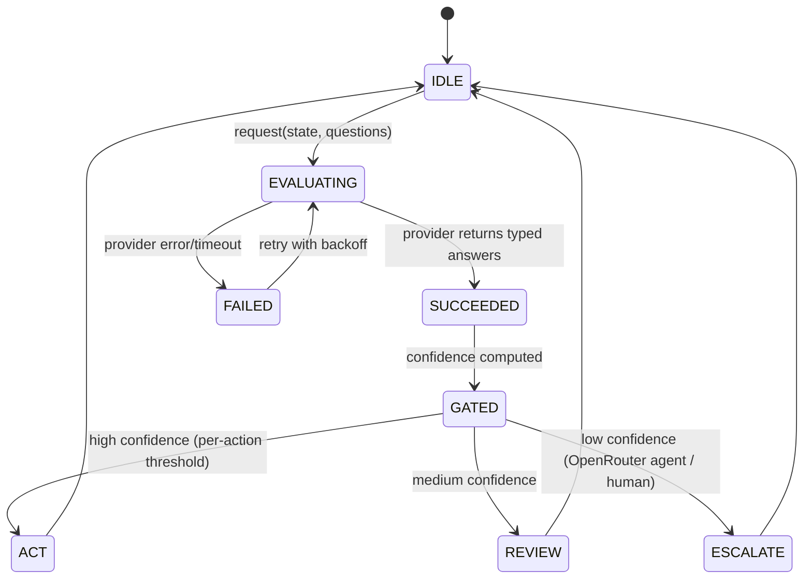
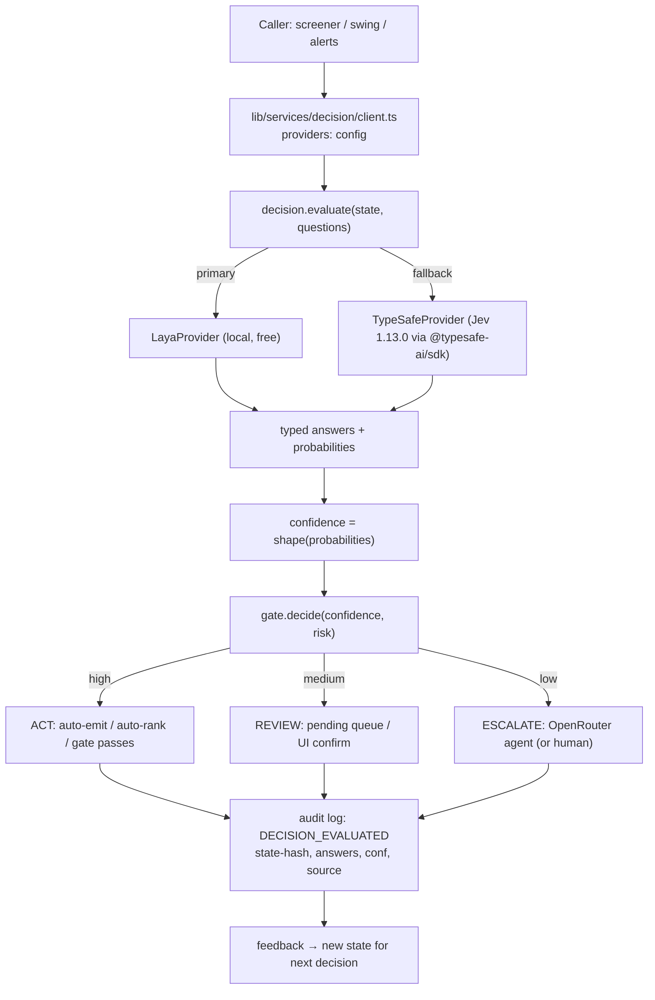
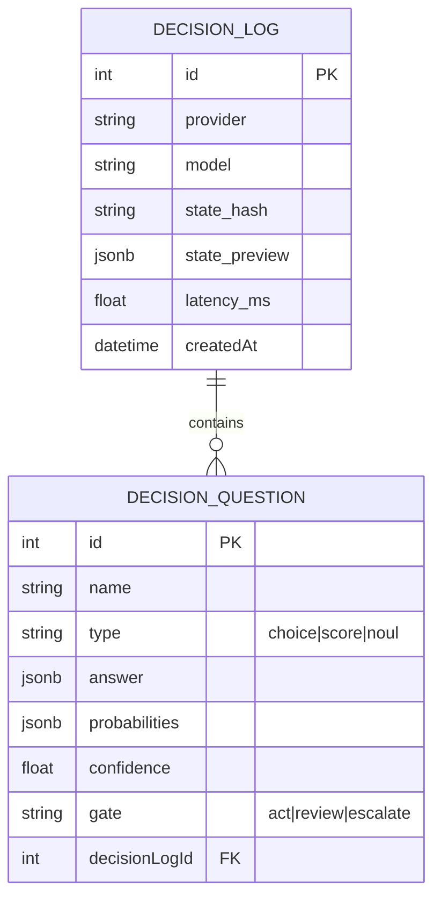

# Laya / System One Decision Engine for TradeNext (ph22)

> **Status**: RESEARCH + PROPOSED DESIGN (v3.41.0 candidate) · **Date**: 2026-09-22
> **Predecessor context**: researched via 5 parallel subagents; full durable extraction in `memory.md`.
>
> **Executive summary**: TradeNext adds a **decision engine** built on the "System One" paradigm. Primary target: **Laya** (`convaiinnovations/laya`, Apache-2.0, local, non-autoregressive) for free in-process calibrated decisions; **TypeSafe AI's Jev 1.13.0** (hosted API) as the cloud counterpart with identical primitives (Choice/Score/Noul) via `@typesafe-ai/sdk`. The engine exposes a clean service layer (`lib/services/decision/`), swaps providers behind one interface, and wires confidence-gated routing into screener ranking, Swing AI, alerts/guardrails, and recommendation gates — with probabilities + confidence on every answer.

---

## 1. Overview

**Goals**
1. Establish a **provider-agnostic decision layer** where a *state* + *atomic questions* → typed answers (choice/score/noul) + calibrated probabilities + confidence.
2. **Primary provider: Laya** — local, free, Apache-2.0, offline-capable (fits TradeNext's self-host posture).
3. **Cloud counterpart: Jev 1.13.0** via `@typesafe-ai/sdk` (`jev-latest`) — same primitive semantics, used when local inference is unavailable or a stronger hosted judge is wanted.
4. Wire **confidence-gated routing** (high → auto-act, medium → review, low → escalate to OpenRouter AI agent) into at least one real workflow (screener rank-fusion + Swing AI gatecheck) as a POC, then generalise.

**What already exists**
- Screener engine (`lib/services/screenerEngine`…), Swing AI signals (34 screeners, AI LONG/SHORT/OBSERVE), recommendations engine (OpenRouter), alerts/guardrails, audit logging.
- No decision/judgment layer today — all classification is either hardcoded rules or full OpenAI/OpenRouter agent calls (expensive, text-generative).

**What changes**
- New `lib/services/decision/` package: `types.ts` (primitives), `provider.ts` (interface), `layaProvider.ts`, `typesafeProvider.ts`, `client.ts` (factory), `gate.ts` (confidence gating helpers).
- Optional local-model runtime scaffolding for Laya (spike first — see §7).
- POC wiring: screener composite scoring + Swing AI auto-generate gatecheck (Plan 15 context).

---

## 2. Lifecycle & State Machine

| Status | Meaning | Exit |
|---|---|---|
| IDLE | provider free, no call in-flight | accept next request |
| EVALUATING | state+questions sent; awaiting answers | SUCCEEDED / FAILED |
| SUCCEEDED | answers + probabilities returned | GATED |
| FAILED | error/timeout | retry (≤3, exp backoff) then fallback provider |
| GATED | confidence thresholds applied | ACT / REVIEW / ESCALATE |
| ACT | auto-apply decision (emit alert, rank stock, gate pass) | IDLE |
| REVIEW | queue for human/UI confirm | IDLE |
| ESCALATE | delegate to OpenRouter AI agent or human | IDLE |

---

## 3. End-to-End Flow

**Numbered steps**
1. Caller builds a `state` (string / JSON / array) + atomic `questions[]` (choice/score/noul with instructions + criteria).
2. `client.evaluate()` selects provider (config `DECISION_PROVIDER=laya|typesafe|auto`; `auto` → try Laya, fallback TypeSafe on failure).
3. Provider runs **parallel, isolated evaluation** of all questions against the same state (speculative fan-out — latency barely grows with question count).
4. Answers are typed: `{ choice, probabilities[], confidence }` | `{ score, probabilities[], confidence }` | `{ noul }`.
5. `confidence` computed from probability-shape (peaked = confident, flat = uncertain).
6. `decide()` applies **per-action, risk-scaled thresholds** → ACT / REVIEW / ESCALATE.
7. Every evaluation is audited (`lib/audit.ts` action `DECISION_EVALUATED`) with state-hash, answers, confidence, provider, latency.
8. Results feed back as new state (loop closure).

---

## 4. Data Model

No new Prisma models required for the engine core (stateless judgments). Optional persistence for REVIEW/audit:

- `DecisionLog` / `DecisionQuestion` — optional; if added, use `AuditLog` metadata JSON instead when possible (avoid plan-limit pressure). Prefer **audit-tag only** initially (P6003 discipline).

---

## 5. API Surface

| Method | Path | Auth | Purpose |
|---|---|---|---|
| POST | `/api/decision/evaluate` | admin (fallback demo) | Run state+questions via configured provider; returns typed answers (POC/debug UI) |
| POST | `/api/admin/decision/ping` | admin | Provider health/round-trip (Laya local load check, TypeSafe key check) |
| — | `lib/services/decision/*` | n/a (server-only) | Internal service API used by screener / swing / alerts orchestrators |

- No new public routes unless a user-facing "review queue" is built (defer).
- Route docs in `app/api/openapi/route.ts` when endpoints land.

---

## 6. UI/UX

POC scope (admin-only, minimal):
- **Admin → Decision engine** panel: provider selector (laya/typesafe/auto), health ping, last evaluations table (state-hash, answers, confidence, gate, latency).
- States: loading skeleton, error with retry (provider unreachable), empty ("no evaluations yet"), responsive (admin grid), dark-mode compliant.
- No new public user-facing UI in POC. Screener/Swing surfaces later consume engine internally.

---

## 7. Implementation Checklist

- [ ] **Spike**: Laya local inference in Node (transformers.js? ONNX? Python sidecar?) — decide before full build (`scripts/spike-laya/`). **Blocking**.
- [ ] `lib/services/decision/types.ts` — `ChoiceQ`, `ScoreQ`, `NoulQ`, `Answer*`, `EvaluateRequest/Response`.
- [ ] `lib/services/decision/provider.ts` — `DecisionProvider` interface (`evaluate`, `health`).
- [ ] `lib/services/decision/layaProvider.ts` — local inference wrapper (spike output) + mock fallback for tests.
- [ ] `lib/services/decision/typesafeProvider.ts` — `@typesafe-ai/sdk` (`TypeSafeClient().systemOne(...)`), env `TYPESAFE_API_KEY`, `jev-latest` default.
- [ ] `lib/services/decision/client.ts` — factory + `auto` failover (Laya → TypeSafe), retry/backoff, latency capture.
- [ ] `lib/services/decision/gate.ts` — confidence shaping + per-risk thresholds (ACT/REVIEW/ESCALATE).
- [ ] Env: `DECISION_PROVIDER`, `DECISION_*` thresholds; document in `.env.example` (no secrets).
- [ ] POC wiring A: screener composite-scoring — rank-fuse candidate stocks with a Score rubric.
- [ ] POC wiring B: Swing AI gatecheck — before auto-generate (Plan 15), `noul`-ish validity gate + confidence gate.
- [ ] Audit: `lib/audit.ts` `DECISION_EVALUATED` (+ `DECISION_PROVIDER_FALLBACK` on failover).
- [ ] Admin panel: `app/admin/decision/page.tsx` + `app/api/admin/decision/…` routes.
- [ ] Swagger/OpenAPI entries for new routes.
- [ ] Tests (see §8) + docs-update pass (AGENTS.md, CHANGELOG, TODO, Primer, agent-memory, README feature table).

---

## 8. Testing

- `lib/__tests__/decisionGate.test.ts` — confidence shaping (flat → low, peaked → high), threshold risk-scaling, ACT/REVIEW/ESCALATE mapping.
- `lib/__tests__/decisionClient.test.ts` — provider selection, failover Laya→TypeSafe on error, retry/backoff, latency capture.
- `lib/__tests__/typesafeProvider.test.ts` — mocked `TypeSafeClient`: request shape (state/questions), answer mapping, env handling.
- `lib/__tests__/layaProvider.test.ts` — mock local inference; real inference spike-gated.
- POC wiring tests: screener rank-fusion (pure functions), Swing gate (noul + confidence branches).
- UI: Playwright admin panel states (loading/error/empty/data), responsive, dark-mode.

---

## 9. Rollout & Rollback

- **Rollout**: merge engine core (feature-flagged, `DECISION_PROVIDER=none` default → engine inert) → enable POC wiring behind `DECISION_POC_ENABLED=true` → ship admin panel.
- **Migration safety**: no destructive migrations; optional `DecisionLog` add-only, TTL-pruned (Plan-limit discipline: prefer audit tags first).
- **Rollback**: flip `DECISION_PROVIDER=none` or remove env → callers fall back to existing rule-based paths; no data dependence.
- **Dependency risk**: `@typesafe-ai/sdk` (v0.6.0, Node 20+; breaking `Score.criteria` = ordered tuple) and Laya runtime must not affect existing paths — engine is isolated + mocked in tests.

---

## 10. Research appendix (condensed)

Full extraction: `memory.md` §1–§6. Key points:

- **Laya** (HF `convaiinnovations/laya`, Apache-2.0): non-autoregressive System-1 decision model, ~33 ms/pass, 100+ langs, 843 MB, RLCD-trained, never generates text.
- **Jev 1.13.0**: NOT open-source (`github.com/answers-ai/jev` = 404 — premise disproven). Proprietary hosted API `POST https://api.typesafe.ai/v1/systemone`, model `jev-latest`; SDK default.
- **Primitives**: Choice `{choice, probabilities[], confidence}`, Score `{score, probabilities[], confidence}` (non-integer allowed), Noul `{noul:0–1}` (no confidence). confidence = f(probability shape).
- **Patterns**: speculative fan-out, confidence-gated routing, composite scoring, intent routing — all compose in code; model is atomic/isolated per question.
- **SDK**: `@typesafe-ai/sdk` v0.6.0, Node 20+, ESM/CJS/TS, env `TYPESAFE_API_KEY` / `TYPESAFE_BASE_URL=https://api.typesafe.ai` / `TYPESAFE_DEFAULT_MODEL=jev-latest`; `client.systemOne({state, questions})`.
- **Open questions** (spike fodder): Laya Node runtime, Jev arch, Noul semantics, Score point-vs-expectation, confidence formula formalisation, latency canonical value, hosted cost model. Medium article = 403 (recovered via snippets only).