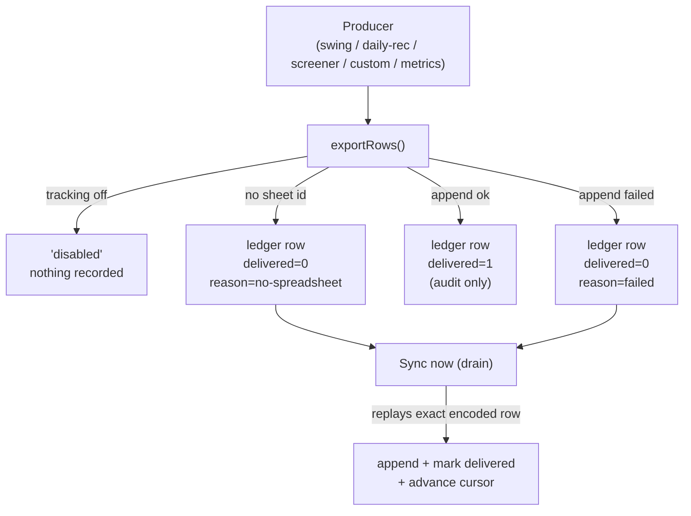

# Google Sheets Tracker — Setup Guide

End-to-end runbook for wiring TradeNext's append-only Google Sheets export to a real
spreadsheet. Covers Google Cloud setup, the spreadsheet contract, OAuth consent, the
environment variables, and how to verify the system actually works.

- **Subsystem**: `lib/services/googleSheets/`
- **Admin console**: `/admin/google-sheets`
- **Shipped in**: v3.42.0 (export) + v3.43.0 (operator console)
- **Status**: code complete and unit-tested. Live end-to-end verification status is
  tracked in [Verification status](#verification-status) at the bottom of this page.

---

## What the subsystem does

TradeNext can mirror five event streams into a Google Sheet you own:

| Tab | Stream | Syncable |
|---|---|---|
| `swing` | Swing-trading signals with AI analysis | yes |
| `daily-rec` | Daily AI recommendation runs | yes |
| `screener` | Unified screener hits | yes |
| `custom` | Saved-config custom scan hits | yes |
| `decisions` | Decision-engine traces | **no** (in-memory ring buffer by design) |
| `metrics` | Recommendation-tracker KPI snapshots | yes |

Everything is **append-only**. The subsystem never clears a range, never truncates,
and never rewrites a header you own. The only destructive action in the entire
subsystem is the guarded ledger `DELETE` (which removes *queue* rows, not sheet rows).

### How data flows

Producers call the exporter **fire-and-forget** and never await it, so tracking can
never slow down or break business logic. Every export attempt is recorded in a
**SQLite ledger** with a `delivered` flag:



"Sync now" does **not** re-query the source tables — it replays the exact cell array
the sheet was meant to receive, captured at export time. Those streams keep nothing
queryable (unified screener uses a throwaway run id and an in-memory cache), so a
re-derivation would either fabricate history or silently diverge from what the live
export writes.

**Delivery guarantee: at-least-once, not exactly-once.** An interrupted append is
indistinguishable from a lost one, so the single in-flight batch during a crash is
the only ambiguity. Delivered rows are never replayed.

---

## Prerequisites

- A Google account that **owns** the target spreadsheet (the token inherits its permissions)
- Access to [Google Cloud Console](https://console.cloud.google.com/)
- Node 20+ and a local checkout
- Local Postgres + SQLite mirror (the ledger and drain are SQLite-first)

---

## Step 1 — Create a Google Cloud project

<https://console.cloud.google.com/projectcreate> → name it (e.g. `TradeNext Sheets`) → **Create**.

A dedicated project keeps the OAuth client and its consent screen isolated from anything
else you host.

## Step 2 — Enable the Google Sheets API

<https://console.cloud.google.com/apis/library> → filter **Google Sheets API** → **Enable**.

You do **not** need the Drive API. `spreadsheets.create` and `spreadsheets.batchUpdate`
work on the Sheets scope alone.

## Step 3 — Configure the OAuth consent screen

Left nav → **Google Auth Platform** → **Audience**.

| Field | Value |
|---|---|
| Publishing status | `Testing` (or `In production` — see the token-expiry note) |
| App name | `TradeNext Sheets` |
| User support email | your address |
| Developer contact | your address |
| Audience type | **External**, or **Internal** if you have a Workspace account |

Then add yourself under **Test users**. This is mandatory while publishing status is
`Testing` — without it the consent screen returns `access_denied` (HTTP 403).

> ### ⚠️ Choose `Internal` if you have a Google Workspace account
> Internal-app refresh tokens **do not expire after 7 days**, and you can skip the
> test-users step entirely. A personal Gmail account is limited to `Testing`, where
> refresh tokens expire **7 days after they are minted** — fine for local verification,
> but production needs the app published.

Requested scope — the only one, and it appears verbatim on the consent screen:

```
https://www.googleapis.com/auth/spreadsheets
```

## Step 4 — Create the OAuth client

**Google Auth Platform → Clients → Create client** (or the legacy
**Credentials → Create Credentials → OAuth client ID**).

> ### ⚠️ Application type must be **Desktop app**
> This is the single step that silently breaks everything downstream.
>
> The consent script listens on `http://localhost:3005` and the runtime uses
> `http://localhost`. A **Desktop** client accepts *any* `http://localhost:<port>`
> automatically. A **Web application** client only accepts redirect URIs you
> pre-registered — and neither of ours is registered, so the callback fails with
> `redirect_uri_mismatch` *after* you have already clicked Allow.

Copy the **Client ID** and **Client secret**. The secret looks like `GOCSPX-…`.
Keep it out of git.

## Step 5 — Create the spreadsheet and its 6 tabs

> ### ⚠️ The subsystem does not create tabs. You must.
> `ensureHeaders()` reads `<tab>!1:1` (the whole first row — v3.43.0 live-verification
> fix, Lesson 149) and classifies the result, and `exportRowsInternal()` **discards
> that function's return value**. A missing tab therefore does not fail fast — the
> append returns HTTP 400, the row is recorded in the ledger as undelivered, and every
> subsequent drain fails identically. The failure surfaces as a permanently stuck tab,
> not as a clear "tab missing" error.

Create a spreadsheet, then give it exactly these tab names:

| Tab | Columns | Notes |
|---|---|---|
| `swing` | 24 | |
| `daily-rec` | 16 | |
| `screener` | 12 | |
| `custom` | 13 | |
| `decisions` | 16 | excluded from sync |
| `metrics` | 11 | console-driven only |

Tab names are **case-sensitive** and must match exactly — the exporter reads them as
`<tab>!1:1` (header probe) and writes to `<tab>!A1` (first empty cell under the header).

**Do not add the header row yourself.** On the first append the subsystem writes the
header when the tab is empty. See [Header policy](#header-policy).

Copy the spreadsheet id from the URL:

```
https://docs.google.com/spreadsheets/d/<SPREADSHEET_ID>/edit
```

## Step 6 — Mint the refresh token

Set `GOOGLE_OAUTH_CLIENT_ID` and `GOOGLE_OAUTH_CLIENT_SECRET` in your environment or
`.env`, then run:

```bash
node scripts/dev-checks/google-oauth-consent.mjs
```

It opens a loopback listener on **port 3005** (deliberately not 3000/3001/4096),
prints a consent URL, and waits. Open the URL, sign in as the **sheet owner**, and
click **Allow**. The browser lands on "Consent captured" and the script prints the
refresh token.

```bash
node scripts/dev-checks/google-oauth-consent.mjs
# paste into .env as GOOGLE_OAUTH_REFRESH_TOKEN
```

**If no refresh token comes back**, Google omitted it because a grant for this client
already exists. Revoke it at <https://myaccount.google.com/permissions> and re-run —
the script forces `prompt=consent` and `access_type=offline`, so a fresh run will mint
one.

The script writes nothing to disk. **Never commit the token.**

## Step 7 — Environment variables

```bash
# Master switch. ONLY the exact string "true" arms the exporter — "1" is OFF,
# so a typo can never silently start writing to your sheet.
GOOGLE_SHEETS_TRACKING_ENABLED=true

# Spreadsheet id (note: SHEET, singular — not GOOGLE_SHEETS_ID)
GOOGLE_SHEET_ID=<spreadsheet id>

# OAuth2 (the refresh token is server-side only)
GOOGLE_OAUTH_CLIENT_ID=<client id>.apps.googleusercontent.com
GOOGLE_OAUTH_CLIENT_SECRET=<client secret>
GOOGLE_OAUTH_REFRESH_TOKEN=<refresh token>
```

> ### ⚠️ `GOOGLE_SHEET_ID`, not `GOOGLE_SHEETS_ID`
> And the token variable is `GOOGLE_OAUTH_REFRESH_TOKEN` — **not**
> `GOOGLE_SHEETS_REFRESH_TOKEN`, which no code path reads. A guide that names the
> wrong variable produces a silent auth failure: the console reports
> `oauthConfigured: false` with no error to explain why.

**`.env` vs `.env.local`** — Next.js loads `.env.local` with *higher* precedence than
`.env`. The consent script calls `process.loadEnvFile()`, which reads **`.env` only**.
If you split credentials across the two files, the script and the dev server can
disagree. Keep the Google vars identical in both.

The spreadsheet id may instead be set through the **admin console**, which takes
precedence over the env value. A sheet id is a *resource identifier*, not a credential,
so it is stored in plaintext by design.

### Deployment

For Netlify, set the same five variables in the site environment. Note that the v3.43
migrations (`20260926000000_add_google_sheets_config`,
`20260926000000_add_google_sheets_ledger`) must be applied before the console's config
and ledger routes work.

---

## Header policy

The column order per tab is a **frozen contract** — encoders emit positionally. On the
first export the subsystem reads `<tab>!1:1` and decides:

| First row | Action | Rationale |
|---|---|---|
| Empty / absent | **Write the header row** | Nothing to preserve |
| Matches expected | No-op | Already correct |
| Anything else | **Do not touch it.** Log `warn`, append by column position | You own the tab; rewriting would shift columns under your historical data |

Inserting a column anywhere but the end silently re-labels every existing row. Never
reorder the columns in a live tracker sheet.

---

## Operating the console

`/admin/google-sheets` exposes:

| Control | Behaviour |
|---|---|
| **Status** | OAuth configured, sheet linked (masked), per-tab header state, queue depth |
| **Config** | Link/unlink the sheet id, toggle the DB switch, set a display name |
| **Sync now** | Drain the backlog for a tab (or all tabs, sequentially) |
| **Metrics** | Append a KPI snapshot from the recommendation tracker |
| **Re-scan** | Run a fresh scan and append fresh rows (produces *new* data, not a sync) |
| **Ledger** | Inspect queued rows; delete poisoned rows |

**Sync is not a re-scan.** Draining replays rows already captured. Re-scanning fires a
real Chartink/TradingView query and creates *new* rows — it burns network quota and is
deliberately a separate action. The two are never merged, so a drain click can never
fire a scan.

**Re-scan ≠ Sync** is also why the screener re-scan path appends internally and the
route deliberately does not double-export.

### Drain semantics

- `SYNC_ROW_CAP = 200` — rows per tab per drain
- `SYNC_CONFIRM_THRESHOLD = 100` — above this, the route requires `confirmed=true`, so
  an accidental double-click cannot push thousands of rows
- `LEDGER_KEEP = 5000` — ledger rows retained after a drain
- Tabs drain **sequentially**; parallel drains would interleave appends and race on
  the singleton config row

**The cursor advances before the marker write is trusted.** The cursor is the primary
replay guard; the `delivered` flag is the secondary one. If the marker write fails the
cursor still advances — otherwise a marker failure would leave the cursor below rows
already on the sheet, and the next drain would append them as duplicates.

**A corrupt row stops the drain.** If a ledger row's JSON is not a non-empty array it
can never be appended. The drain parks the cursor directly below the *first* such row
and reports its seq, because advancing past it would make the row permanently
invisible (counted in `queued` forever, but no drain could ever report its seq again
for the operator to delete). Later rows are held back in order and picked up on the
pass after removal.

---

## Troubleshooting

| Symptom | Cause | Fix |
|---|---|---|
| `redirect_uri_mismatch` after clicking Allow | OAuth client created as **Web application** | Recreate as **Desktop app** |
| `Access blocked … has not completed the Google Verification process` | `Testing` status and your account is not a test user | Google Auth Platform → Audience → Test users → add your email |
| `No refresh_token in the response` | A grant for this client already exists | Revoke at <https://myaccount.google.com/permissions>, re-run the script |
| Console shows `oauthConfigured: false`, no error | Wrong env var name (e.g. `GOOGLE_SHEETS_REFRESH_TOKEN`) | Use `GOOGLE_OAUTH_REFRESH_TOKEN` |
| 401 on every append | Testing-mode refresh token expired (7 days) | Re-run the consent script, or publish the app |
| Tab stays `queued`, every drain fails, sheet empty | Tab does not exist in the spreadsheet | Create the tab with the exact name |
| UI shows every populated tab as "drifted" and the console never writes a header | **Header-probe range bug**: `readHeaderState` read `${tab}!A1` (a 1×1 cell), so ANY populated multi-column header misclassified as drifted (found in live verification, Lesson 149) | Probe `${tab}!1:1` (the whole first row); write target stays `A1` |
| Appends succeed but data lands under the wrong headers | Header drifted; system appended positionally by design | Restore the correct header order manually, then re-check |
| `X queued` never reaches 0 after a successful drain | Marker-write residue: the append landed, the `delivered` flag write failed | Harmless — residue is never replayed and ages out with the retention window |
| 404 on the Sheets API | API not enabled on the project | Enable **Google Sheets API** |
| Every export reports `"disabled"` | `GOOGLE_SHEETS_TRACKING_ENABLED` is not exactly `"true"`, or the DB switch is off | Check both; the DB switch can only restrict, never arm |

---

## Verification status

Track live verification here so the docs never claim more than has been executed.

| Check | Status |
|---|---|
| Unit tests (`lib/__tests__/*googleSheets*`) | 142 passing + range pins (`1:1`) |
| E2E console (`e2e/admin-google-sheets.spec.ts`, 3 browsers) | passing — **routes mocked** |
| OAuth consent against real Google | ✅ **DONE** (2026-09-28, Testing-mode token, sheet owner) |
| Real append to a real spreadsheet | ✅ **DONE** — two `metrics` snapshots appended live (`2026-09-28T14:24:45.344Z` and `15:43:36.687Z`), positional 11-col rows, ratios `null` as contracted |
| Header-state fix live | ✅ **DONE** — after the `1:1` probe fix, `metrics` = `matched`, other tabs `absent` see the A1 fix in the troubleshooting table |
| Live sync / drain | ✅ **DONE** — POST `/sync {tabs:["metrics"]}` 200 `status=empty` (nothing owed — direct append already recorded `delivered=1`); re-run idempotent, no duplicates |
| `decisions` sync exclusion | ✅ **DONE** — `skipped`, "excluded by spec (in-memory only, not syncable)" |
| Metrics projection under P6003 hold | ✅ **DONE** — preview `ok:true totalTracked=121 active=121` despite the breaker (the documented "hold blocks the projection" assumption was wrong — reads are unaffected) |
| Poisoned-row recovery against a real ledger | ⛔ **NOT run live by design** — destructive on the user's real sheet; covered by 21 Jest tests + e2e mocks |

The committed E2E suite mocks the Sheets routes on purpose. OAuth consent is a
one-shot manual step, a real append is irreversible by design, and the ledger is
durable state a test must not depend on — so the suite asserts the console's own
contract (which request it sends, what it tells the operator) while Jest covers server
behaviour.

---

## Related

- `lib/services/googleSheets/tabs.ts` — tab registry and frozen column contracts
- `lib/services/googleSheets/exporter.ts` — append path, retry, ledger capture
- `lib/services/googleSheets/syncService.ts` — drain, cursor, corrupt-row parking
- `lib/services/googleSheets/configService.ts` — sheet id resolution, DB switch
- `scripts/dev-checks/google-oauth-consent.mjs` — one-time token mint
