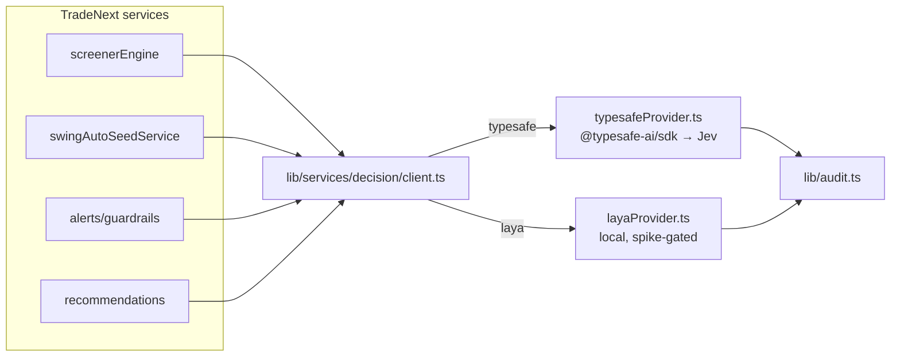

# Jev SDK — TradeNext Integration Guide

> **Status**: DESIGN + CODE SKETCHES (not implemented — no code ships until ph22 spec + plan are human-approved) · 2026-09-22
> **Design doc**: `docs/designDoc/ph22-laya-decision-engine-design.md` · **Jev reference**: `docs/jev.md` · **Durable memory**: `memory.md` §2–§4
> **Sensitive ops requiring explicit user permission**: `npm install @typesafe-ai/sdk`, setting `TYPESAFE_API_KEY` env, first live `POST /v1/systemone` spike.

---

## 0. Agent quick-abstract (read this first)

- **Goal**: give TradeNext a fast, cheap, calibrated judgment layer for "middle band" decisions (between hardcoded rules and expensive OpenRouter text calls), using TypeSafe's Jev (`@typesafe-ai/sdk` v0.6.0) as ONE provider behind a provider-agnostic engine (`lib/services/decision/`).
- **Status**: NOT built. Engine = ph22 spec + plan + human approval, then implement per spec-driven-development.
- **Default inert**: `DECISION_PROVIDER=none` is the shipped default — callers fall back to existing rule-based paths (rollback safety, ph22 §9).
- **Jev role**: `typesafeProvider.ts` (cloud) as primary/fallback for `typesafe`/`auto` modes; `layaProvider.ts` (local, spike-gated) is the other provider.
- **Env**: `TYPESAFE_API_KEY` server-only; `DECISION_PROVIDER=none|typesafe|laya|auto` (default `none`); `DECISION_POC_ENABLED=false`.
- **SDK gotcha**: v0.6.0 `Score.criteria` = **ordered tuple**.
- **Testing**: all providers mocked — `TYPESAFE_API_KEY` never required in CI/tests.
- **Audit**: `DECISION_EVALUATED`, `DECISION_PROVIDER_FALLBACK`, `DECISION_GATE` via `lib/audit.ts` metadata JSON; no new Prisma model in POC (P6003 plan-limit discipline).

---

## 1. Where Jev fits (TradeNext surfaces)

| Surface | Jev decision | Primitive | Risk tier |
|---|---|---|---|
| Screener rank fusion (POC A) | "Score setup/trend/momentum/risk vs rubric" | `score` ×4 → weighted sum | read-only |
| Swing AI gatecheck (POC B, Plan 15) | "Valid to auto-generate targets now?" + regime | `noul` + `choice` | moderate |
| Alerts guardrails | "Real anomaly or noise?" | `noul` | moderate |
| Recommendation confidence | "Is this pick still active/valid?" | `noul` | read-only |



---

## 2. Env & install (permission-gated)

```bash
# .env.example additions (placeholders only — NEVER commit real keys)
TYPESAFE_API_KEY=            # server-only; console.typesafe.ai
TYPESAFE_BASE_URL=https://api.typesafe.ai   # optional
TYPESAFE_DEFAULT_MODEL=jev-latest           # optional
DECISION_PROVIDER=none      # none | typesafe | laya | auto  (none = engine inert)
DECISION_POC_ENABLED=false
```

```bash
npm install @typesafe-ai/sdk    # v0.6.0 — RUN ONLY WITH USER PERMISSION
```

---

## 3. File map (planned — ph22 §7)

| File | Purpose | Status |
|---|---|---|
| `lib/services/decision/types.ts` | Primitives: `ChoiceQ/ScoreQ/NoulQ`, `Answer*`, `EvaluateRequest/Response` | DESIGN |
| `lib/services/decision/provider.ts` | `DecisionProvider` interface (`evaluate`, `health`) | DESIGN |
| `lib/services/decision/typesafeProvider.ts` | Jev via `@typesafe-ai/sdk` | DESIGN (sketch below) |
| `lib/services/decision/layaProvider.ts` | Laya local wrapper (spike first) — **blocking spike** | DESIGN |
| `lib/services/decision/client.ts` | Factory + failover (`auto` = Laya → Jev), retry/backoff, latency | DESIGN (sketch below) |
| `lib/services/decision/gate.ts` | Confidence → ACT/REVIEW/ESCALATE (risk-scaled) | DESIGN (sketch below) |
| `app/api/decision/evaluate` | Admin POC/debug | DEFERRED |
| `app/api/admin/decision/ping` | Provider health | DEFERRED |
| `app/admin/decision/page.tsx` | Admin panel (states: loading/error/empty/data) | DEFERRED |

---

## 4. Contracts (copy-paste source)

### 4.1 `types.ts` — primitives

```ts
export type DecisionPrimitive = "choice" | "score" | "noul";

export interface ChoiceQ { type: "choice"; name: string; options: string[]; instruction?: string; statePath?: string; }
export interface ScoreQ  { type: "score"; name: string; criteria: string[]; instruction?: string; statePath?: string; }
export interface NoulQ   { type: "noul"; name: string; instruction?: string; statePath?: string; }
export type DecisionQuestion = ChoiceQ | ScoreQ | NoulQ;

export interface ChoiceAnswer { choice: string; probabilities: number[]; confidence: number; }
export interface ScoreAnswer  { score: number; probabilities: number[]; confidence: number; }
export interface NoulAnswer   { noul: number; }
export type DecisionAnswer = ChoiceAnswer | ScoreAnswer | NoulAnswer;

export interface EvaluateRequest { state: unknown; questions: DecisionQuestion[]; model?: string; }
export interface EvaluateResponse { answers: Record<string, DecisionAnswer>; provider: string; model: string; latencyMs: number; }
```

### 4.2 `provider.ts` — seam

```ts
export interface DecisionProvider {
  readonly provider: string;                      // "typesafe" | "laya"
  evaluate(req: EvaluateRequest): Promise<EvaluateResponse>;
  health(): Promise<{ ok: boolean; detail?: string }>;
}
```

### 4.3 `typesafeProvider.ts` — Jev impl

```ts
import { TypeSafeClient, choice, score, noul } from "@typesafe-ai/sdk";
import logger from "@/lib/logger";
import type { DecisionProvider, EvaluateRequest, EvaluateResponse, DecisionQuestion } from "./types";

const MODEL = process.env.TYPESAFE_DEFAULT_MODEL || "jev-latest";

function toSdkQuestion(q: DecisionQuestion) {
  if (q.type === "choice") return choice({ name: q.name, options: q.options });
  if (q.type === "score")  return score({ name: q.name, criteria: q.criteria }); // ⚠ ordered tuple v0.6.0
  return noul({ name: q.name });
}

export class TypeSafeProvider implements DecisionProvider {
  readonly provider = "typesafe";
  constructor(private readonly client: TypeSafeClient = new TypeSafeClient()) {}

  async evaluate(req: EvaluateRequest): Promise<EvaluateResponse> {
    const started = performance.now();
    try {
      const res = await this.client.systemOne({
        state: req.state,
        questions: req.questions.map(toSdkQuestion),
        ...(req.model ? { model: req.model } : {}),
      });
      const latencyMs = Math.round(performance.now() - started);
      logger.info({ msg: "Decision evaluated via Jev", provider: "typesafe", model: res.model ?? MODEL, latencyMs });
      return { answers: res.answers, provider: "typesafe", model: res.model ?? MODEL, latencyMs };
    } catch (e) {
      logger.error({ msg: "Jev evaluation failed", error: e instanceof Error ? e.message : String(e) });
      throw e; // client owns retry + failover
    }
  }

  async health() {
    try { await this.client.models.list(); return { ok: true }; }
    catch (e) { return { ok: false, detail: e instanceof Error ? e.message : "unknown" }; }
  }
}
```

> **Note**: SDK answers (`res.answers`) already carry `{ choice|score|noul, probabilities[], confidence }` — map onto the shared `DecisionAnswer` verbatim (no shape loss).

### 4.4 `client.ts` — factory + failover

```ts
import { TypeSafeProvider } from "./typesafeProvider";
// import { LayaProvider } from "./layaProvider"; // spike-gated
import type { DecisionProvider, EvaluateRequest, EvaluateResponse } from "./types";
import logger from "@/lib/logger";

const PROVIDER_ENV = (process.env.DECISION_PROVIDER || "none").toLowerCase();

export interface DecisionClient {
  evaluate(req: EvaluateRequest): Promise<EvaluateResponse | null>; // null = disabled
  provider(): string;
}

export function createDecisionClient(): DecisionClient {
  const providers: DecisionProvider[] = [];
  if (PROVIDER_ENV === "typesafe" || PROVIDER_ENV === "auto") providers.push(new TypeSafeProvider());
  // auto / laya: push LayaProvider first when spike lands → failover order Laya → Jev

  return {
    provider: () => providers.map((p) => p.provider).join("|") || "none",

    async evaluate(req) {
      if (providers.length === 0) return null;           // DECISION_PROVIDER=none → inert
      let lastErr: unknown;
      for (const [i, p] of providers.entries()) {
        try {
          return await p.evaluate(req);                  // retry ≤3 exp-backoff here per provider (ph22)
        } catch (e) {
          lastErr = e;
          if (i < providers.length - 1)
            logger.warn({ msg: "Decision provider failed → failover", from: p.provider });
          // audit DECISION_PROVIDER_FALLBACK (lib/audit.ts) — see §6
        }
      }
      logger.error({ msg: "All decision providers failed", error: lastErr instanceof Error ? lastErr.message : String(lastErr) });
      throw lastErr;
    },
  };
}
```

### 4.5 `gate.ts` — confidence gating

```ts
export type Gate = "act" | "review" | "escalate";
export type Risk = "read-only" | "moderate" | "destructive";

const THRESHOLDS: Record<Risk, { act: number; review: number }> = {
  "read-only":   { act: 0.55, review: 0.35 },   // rank/scoring — reversible
  moderate:      { act: 0.75, review: 0.50 },   // alert emit, swing gate
  destructive:   { act: 0.90, review: 0.70 },   // trade/tax — humans first
};

export function decide(confidence: number, risk: Risk): Gate {
  const t = THRESHOLDS[risk];
  if (confidence >= t.act) return "act";
  if (confidence >= t.review) return "review";
  return "escalate";
}
```

---

## 5. POC wiring

### POC A — screener composite scoring (rank fusion)
- One `state` per candidate symbol (price, %Δ, MA distances, RSI, volume ratio).
- ONE request with 4 `score` rubrics: `trend_quality`, `momentum_quality`, `risk_profile`, `setup_quality`.
- Fuse in code: `composite = Σ wᵢ·scoreᵢ`; per-factor gate via `decide(conf, "read-only")`.
- Tests: pure functions (weighted fusion, gating) + mocked provider; UI unchanged (screener sort re-ranks only).

### POC B — Swing AI gatecheck (Plan 15)
- Before Swing auto-generate-once seeds AI targets: `noul` "Is it valid/appropriate to auto-generate AI targets now?" + `choice` regime `["trending","choppy","uncertain"]`.
- Gate `moderate`: `noul ≥ 0.75` + bias toward `trending` → auto-generate; else REVIEW; else skip (audited NO-OP — preserves Plan 15 seed-once semantics).

---

## 6. Auditing

- `lib/audit.ts` new actions: `DECISION_EVALUATED` (state-hash, answers, confidence, provider, latencyMs), `DECISION_PROVIDER_FALLBACK` (failover), `DECISION_GATE` (per-question gate result).
- Metadata JSON over new Prisma model initially (P6003 discipline — ph22 §4). Optional `DecisionLog`/`DecisionQuestion` add-only, TTL-pruned, deferred.

---

## 7. Testing

| Suite | Covers |
|---|---|
| `decisionGate.test.ts` | confidence shaping (flat→low, peaked→high), risk scaling, ACT/REVIEW/ESCALATE mapping |
| `decisionClient.test.ts` | provider selection, `none` → inert, failover, retry/backoff, latency capture |
| `typesafeProvider.test.ts` | mocked `TypeSafeClient`: request shape (state/questions), answer mapping, env defaults, error throw |
| `layaProvider.test.ts` | mock local inference (spike-gated) |
| Screener fusion / Swing gate tests | POC pure functions, noul+choice branches |
| Playwright | admin decision panel states (loading/error/empty/data), responsive, dark-mode |

`TYPESAFE_API_KEY` never required in tests (all providers mocked).

---

## 8. Rollout & rollback

1. Engine core merged with `DECISION_PROVIDER=none` (inert) — no behavior change.
2. `DECISION_POC_ENABLED=true` behind feature flag; ship admin panel.
3. Live smoke test (`POST /v1/systemone`, real key — human-approved) → flip `DECISION_PROVIDER=typesafe` or `auto`.
4. **Rollback** = set `DECISION_PROVIDER=none` / remove env → callers fall back to rule-based paths; zero data dependence.

---

## 9. Permission gates (sensitive ops — ALWAYS ask)

- [ ] User permission: `npm install @typesafe-ai/sdk`
- [ ] User permission: `TYPESAFE_API_KEY` env on dev/staging (never committed)
- [ ] User permission: live `systemOne` smoke test (validates endpoint, answer shapes, latency, cost)
- [ ] User permission: ph22 spec + plan (spec-driven development gate — no exceptions)

---

## 10. Completion checklist

- [ ] ph22 spec (`.agents/specs/`) + plan (`.agents/plans/`) human-approved
- [ ] `lib/services/decision/*` + tests (§7)
- [ ] Audit actions + OpenAPI entries
- [ ] Admin panel + Playwright states
- [ ] Docs pass — AGENTS.md version row, CHANGELOG, TODO, Primer, agent-memory, Lessons

---

## Related

- `docs/jev.md` — full Jev reference (identity, contract, primitives, from-scratch guide).
- `docs/jev.html` — visual version of Jev + integration design.
- `docs/designDoc/ph22-laya-decision-engine-design.md` — the engine design this guide implements.
- `docs/laya.md` + `memory.md` — Laya local counterpart + durable research.