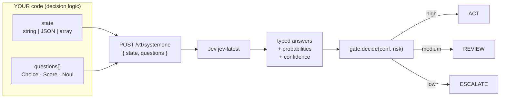
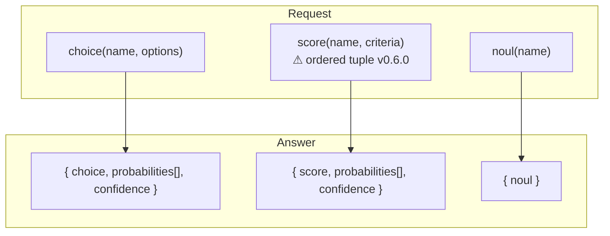
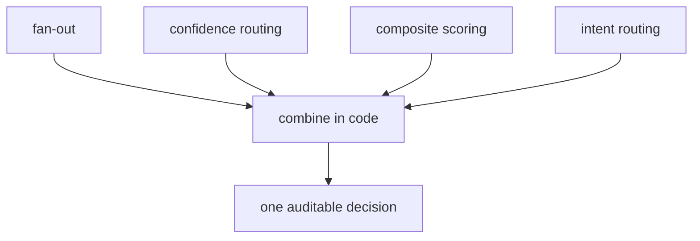

# Jev — TypeSafe System One Model (hosted decision API)

> **Status**: RESEARCH doc — no code shipped · Snapshot 2026-09-22
> **Source of truth**: https://docs.typesafe.ai (intro / ML primer / concepts / primitives / patterns / sdk) · https://typesafe.ai · https://console.typesafe.ai
> **Related**: `memory.md` §2–§4 (durable, condensed) · `docs/laya.md` (local counterpart) · `docs/designDoc/ph22-laya-decision-engine-design.md` (engine design) · `docs/jev-tradenext-integration.md` (TradeNext SDK usage) · `docs/jev.html` (human visual)

---

## 0. Agent quick-abstract (read this first)

- **Jev is NOT open-source.** `github.com/answers-ai/jev` → **404** (premise disproven during research). Jev is TypeSafe AI's **proprietary, closed-API** model — "the first public System One model".
- **Access**: hosted only — no weights, no self-host. Consumed via `POST https://api.typesafe.ai/v1/systemone` or the official SDK.
- **Models**: `jev-1.13.0` (response examples) / `jev-latest` (request examples; SDK default). High-water mark at research: **1.13.0**.
- **Paradigm**: judge, not generator — one `state` + atomic `questions[]` → typed answers with probabilities (+ confidence). The model **never picks its own next step**; decision logic lives in YOUR code.
- **Primitives**: `Choice {choice, probabilities[], confidence}` · `Score {score, probabilities[], confidence}` (non-integer scores allowed) · `Noul {noul: 0–1}` (no confidence field).
- **SDK**: `@typesafe-ai/sdk` **v0.6.0** (Node 20+, ESM+CJS+TS). ⚠️ Breaking: `Score.criteria` = **ordered tuple**. Env: `TYPESAFE_API_KEY` (req), `TYPESAFE_BASE_URL`, `TYPESAFE_DEFAULT_MODEL=jev-latest`, `TYPESAFE_LOG_LEVEL=warn`.
- **Patterns**: speculative fan-out · confidence-gated routing · composite scoring · intent routing (all composed in code).
- **Verification ledger**: docs pages ✅ fetched; endpoint **NOT hit** (no key) → a live smoke test is required before any engine build.

---

## 1. What Jev is

| Property | Value |
|---|---|
| Vendor | TypeSafe AI (cofounder Diogo Almeida co-invented RLHF; RLCD training) |
| License/status | **Proprietary hosted API** (not OSS, not downloadable) |
| Endpoint | `POST https://api.typesafe.ai/v1/systemone` |
| Console | https://console.typesafe.ai/ (playground, shared decode links) |
| Architecture class | System One: **non-text-generative decision model** — typed answers + calibrated probabilities in one pass |
| RLCD training | log + spherical strictly-proper scoring rules + REINFORCE w/ group-mean baseline + TD(λ=1.0) |
| Latency claim | ~0.114 s/decision (homepage) vs ~100 ms (docs build page) vs 150 ms (use-case map) — **discrepancy not reconciled** |
| Cost claim | "194.6× cheaper / 193.6× faster" than a leading reasoning LLM — **marketing baseline uncaptured, directional only** |

**Jev vs Laya**: Laya (`docs/laya.md`) = local, free, Apache-2.0, same System One paradigm, ~33 ms/pass, 843 MB. Jev = hosted cloud judge — use when local inference is unavailable or a hosted judge is preferred.

---

## 2. Request anatomy & contract

Every decision = one HTTP round-trip, parallel isolated evaluation of all questions:



**Rules**:
1. **One `state` per request** shared by all questions. No thread/multi-turn memory — multi-step = code re-issuing requests.
2. **Atomic questions** — each targets a single decision; add more questions to the same request (fan-out), don't complicate structure.
3. **Atomicy paths** — backticked path in `state_path` (e.g. `` `support.tickets[0].message` ``) points a question at a nested state slice → isolated evaluation → no "context-rot".
4. **No autonomy** — the model returns data; routing/actions/thresholds are yours.

---

## 3. Primitives (typed answers)

| Primitive | Answer shape | Confidence? | Use for |
|---|---|---|---|
| `choice` | `{ choice, probabilities[], confidence ∈ [0,1] }` | ✅ | Pick one of N named options |
| `score` | `{ score, probabilities[], confidence ∈ [0,1] }` | ✅ | Position on ordered rubric (1.4 allowed) |
| `noul` | `{ noul: 0–1 }` | ❌ | Truth value ("is X true?") |



**Confidence** = f(probability-shape): peaked → confident; flat → uncertain. Docs illustrate the `(count·peak − 1)/(count − 1)` family (uniform → 0, one-hot → 1). **Not formalised yet** (cookbook "planned").

**Calibration**: probabilities track actual outcome frequency across groups — conf 0.2 → right ~20% of the time; 1.0 → essentially always.

---

## 4. From-scratch implementation

Prereqs: **Node.js 20+**, TypeSafe account + API key (https://console.typesafe.ai), network to `api.typesafe.ai`.

### 4.1 Get a key + env
```
TYPESAFE_API_KEY=sk-...            # required, never commit
TYPESAFE_BASE_URL=https://api.typesafe.ai   # optional (SDK default)
TYPESAFE_DEFAULT_MODEL=jev-latest  # optional (SDK default)
TYPESAFE_LOG_LEVEL=warn            # optional (SDK default)
```

### 4.2 Install
```bash
npm install @typesafe-ai/sdk        # v0.6.0 — Score.criteria = ORDERED TUPLE
```

### 4.3 First call
```ts
import { TypeSafeClient, choice, score, noul } from "@typesafe-ai/sdk";

const client = new TypeSafeClient(); // reads TYPESAFE_* env

const res = await client.systemOne({
  state: { symbol: "RELIANCE", price: 2950.4, prevClose: 2870.1, ma20: 2840.0, changePct: 2.8 },
  questions: [
    choice({ name: "bias", options: ["bullish", "neutral", "bearish"] }),
    score({ name: "setup_quality", criteria: ["poor", "average", "good", "excellent"] }),
    noul({ name: "above_ma20", instruction: "Is the price above MA20?" }),
  ],
});

const bias    = res.answers["bias"];            // { choice, probabilities[], confidence }
const quality = res.answers["setup_quality"];   // { score, probabilities[], confidence }
const gate    = res.answers["above_ma20"];      // { noul }

// optional: const models = await client.models.list();
```

### 4.4 Interpret answers
```ts
bias.choice;          // "bullish"
bias.probabilities;   // [0.62, 0.24, 0.14] — aligned with options order
bias.confidence;      // 0-1; high when distribution is peaked
quality.score;        // 2.3 — non-integer allowed
gate.noul;            // 0.97
```

---

## 5. Patterns (compose in code)

| Pattern | Recipe |
|---|---|
| **Speculative fan-out** | Ask ALL potentially-needed atomic questions in ONE request — adding questions ≈ no extra latency |
| **Confidence-gated routing** | high conf → act · medium → review/confirm · low → escalate (human/AI). Thresholds per-action, risk-scaled |
| **Composite scoring** | multiple `score` answers → weighted sum (`Σ wᵢ·scoreᵢ`) → one rank/decision |
| **Intent routing** | `choice` over intents (e.g. `["screen","backtest","alerts"]`) → branch in code |



---

## 6. Production considerations (TradeNext)

1. **Secrets** — `TYPESAFE_API_KEY` server-only; never in client components; never logged.
2. **Failure handling** — try/catch + retry (≤3, exp backoff) → fail over (Laya local, then rule-based path).
3. **Latency** — hosted round-trip adds network time; keep request volume low; cache repeated decisions by (stateHash + question set) when state is stable.
4. **Cost/limits** — free-vs-paid key model **undocumented**; feature-flag behind `DECISION_PROVIDER=none` default (engine inert).
5. **Audit** — log every evaluation (state hash, answers, confidence, provider, latency) via `lib/audit.ts` `DECISION_EVALUATED` / `DECISION_PROVIDER_FALLBACK` (see ph22).

---

## 7. Verification ledger (what is actually proven)

| Claim | Source | Verified? |
|---|---|---|
| Endpoint + method | docs.typesafe.ai | ✅ fetched (not hit — no key) |
| Primitives shapes | docs primitives pages | ✅ fetched |
| SDK API (v0.6.0) | docs sdk pages + npm | ✅ fetched |
| `Score.criteria` ordered tuple (breaking) | docs / npm | ✅ fetched |
| Env vars + defaults | docs sdk | ✅ fetched |
| `github.com/answers-ai/jev` | GitHub | ❌ **404 — premise disproven** |
| Medium Laya article | medium.com | ❌ 403 blocked (search snippets only) |
| Latency/cost claims | homepage + docs | ⚠️ fetched but contradictory/marketing |

---

## 8. Open questions (for engine design)

1. Jev underlying architecture — docs claim "new architecture/sampler/training" but ML primer implies pretrained-LM base (**unresolved**).
2. Noul semantics/etymology; is a 2-atom distribution backing it?
3. Score — point estimate vs expectation over level distribution?
4. Confidence formula — demo-illustrated, not formal (cookbook "planned", link TBA).
5. Canonical latency — ~100 ms vs 150 ms vs 0.114 s.
6. Hosted cost/limits — undocumented on fetched pages.
7. **Live `POST /v1/systemone` smoke test — NOT performed (no key)** — required before engine build.

---

## 9. Related docs

- `memory.md` §2–§4 — durable condensed reference (budget-preserving; read this instead of re-scraping).
- `docs/laya.md` — Laya, the local Apache-2.0 counterpart.
- `docs/jev-tradenext-integration.md` — **how to use the Jev SDK inside TradeNext + integration guide**.
- `docs/jev.html` — visual/interactive version of this doc (Mermaid, dark theme).
- `docs/designDoc/ph22-laya-decision-engine-design.md` — provider-agnostic decision engine that will wrap Jev behind `lib/services/decision/typesafeProvider.ts`.
- https://docs.typesafe.ai — authoritative docs index.